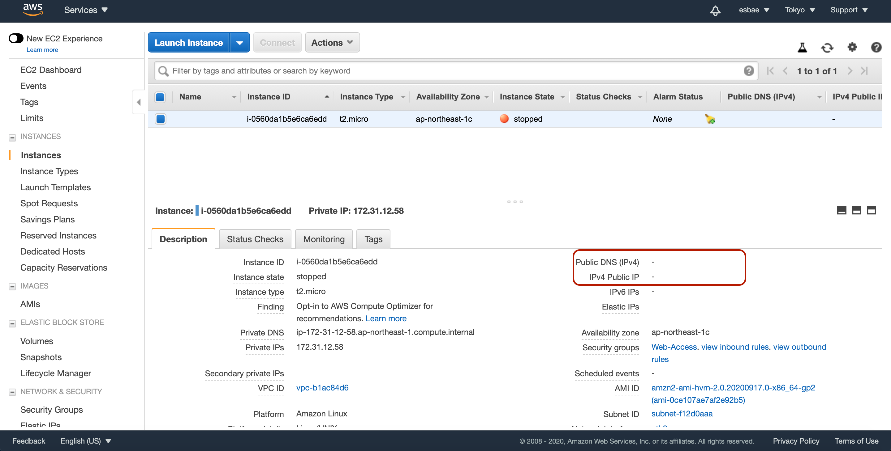

# Private IP Address

인스턴스를 런칭하고 ip 확인해보기

* 기본옵션으로 리눅스 인스턴스 하나를 런칭했다
* 사진에 보이는 빨간 상자 부분에 각각 퍼블릭 아이피와 프라이빗 아이피가 할당되어 있는 것을 확인할 수 있다
* 모든 인스턴스는 퍼블릭 서브넷에 있든 프라이빗 서브넷에 있든 프라이빗 아이피를 가진다
* 항상 인스턴스는 하나의 프라이빗 아이피를 가지며 이 주소의 범위는 VPC와 서브넷에 할당된 주소 범위로부터 지정된다

* 위에서 생성한 인스턴스가 포함되어 있는 서브넷이다
* 서브넷의 cidr블럭 범위 내(172.31.0.0/20)에서 인스턴스의 프라이빗 아이피(172.31.12.58)가 결정되어 있다

터미널에서 ec2인스턴스에 접속해 아이피 어드레스를 확인해보기

* ifconfig 명령어를 입력한다
* eth0 이더넷에 프라이빗 아이피만 보이는 것을 확인할 수 있다
* 이처럼 인스턴스는 퍼블릭 아이피나 엘라스틱 아이피에 관련된 어떤 정보도 찾을 수 없다
  - AWS가 외부와의 통신을 위해 매핑시켜주는 것일 뿐이다

인스턴스를 중지(Stop)시키고 퍼블릭 아이피 어드레스 확인해보기

* 인스턴스를 선택하고 액션탭을 눌러 인스턴스를 중지시켜보자
* 시간이 흐른뒤 정지가 완료되면 위의 사진과 같이 퍼블릭 아이피 어드레스가 사라진 것을 확인할 수 있을 것이다
