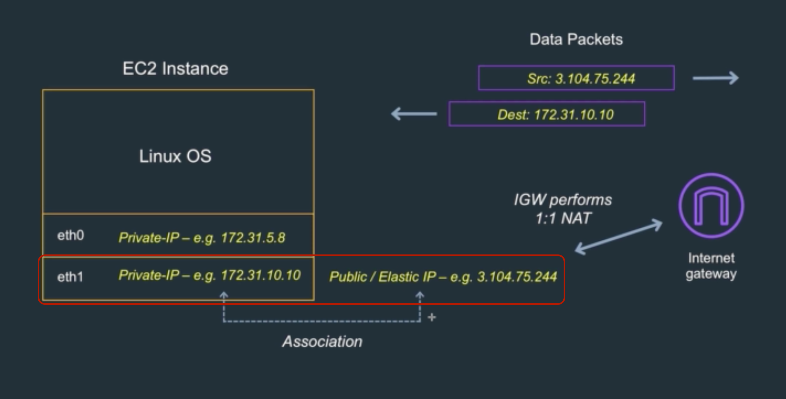

# Public IP Address

퍼블릭 아이피와 엘라스틱 아이피
* 퍼블릭 아이피는 엘라스틱 아이피와 혼동되기 쉽다
* 두 아이피 모두 외부와의 통신을 하기 위해 사용되기 때문이다
  - 두 아이피는 인스턴스와 연결되어 있을 때 프라이빗 아이피와 연결되어 있다
* 두 아이피의 가장 큰 차이점은 동적인가 정적인가의 여부다
  - 퍼블릭 아이피는 앞선 내용에서 봤듯이 인스턴스가 정지되면 사라졌다가 재개되면 재할당된다
  - 엘라스틱 아이피는 인스턴스가 중지되어도 아이피가 유지된다
* 또 다른 차이점으로는 엘라스틱 아이피는 이동 범위가 다르다는 것이다
  - 엘라스틱 아이피는 인스턴스와 엘라스틱 네트워크 어댑터(Elastic network adapter)사이에서 이동할 수 있다
  - 엘라스틱 네트워크 어댑터는 이후에 다뤄볼 것이다
* 퍼블릭 아이피는 비용을 지불하지 않아도 된다
  - 엘라스틱 아이피는 인스턴스나 엘라스틱 네트워크 어댑터에 사용하지 않더라도 비용을 지불해야 한다

* 앞서 9장에서 봤던 퍼블릭 인스턴스와 연결된 그림과 마찬가지로 엘라스틱 아이피도 작동한다

정지후 시작과 리부트의 차이
* 앞서 10장에서 인스턴스를 정지하면 퍼블릭 ip가 사라지고 다시 시작하면 새로운 퍼블릭 아이피가 할당된 것을 확인했다
* 정지 후 시작과 달리 리부트는 기존의 퍼블릭 아이피 어드레스를 그대로 사용한다는 것을 알아두자