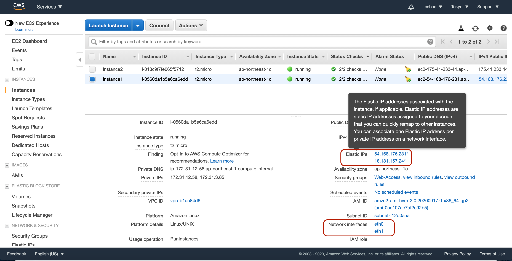

# Elastic IP Addresses and Elastic Network Interface

실습을 위해 두 개의 EC2인스턴스 생성하기
* 모두 기본 옵션으로 설정하고 같은 서브넷, 시큐리티그룹(WebAccess)을 지정한 뒤 이름을 Instance1, Instance2로 변경해주자

엘라스틱 IP 생성하기

* EC2화면에서 엘라스틱 아이피 탭을 누른다
* 그런 다음 새 주소를 할당하기 버튼을 누른다

* 할당하기 버튼을 누르면 생성이 완료된다

생성한 엘라스틱 아이피 할당하기

* 빨간 상자에 체크해놓은 부분을 클릭한다

아래 그림을 보며 인스턴스와 프라이빗 아이피를 선택하자

* instance1을 선택하면 된다

* 프라이빗 아이피는 하나 밖에 없으므로 그것을 선택하면 된다
* 선택을 완료했으면 할당 버튼을 눌러 완료시켜주자

인스턴스 목록 탭에서 할당된 인스턴스 정보 확인하기

* Elastic IPs란에 앞서 생성한 아이피가 할당되어 있다
* 그 바로 위에 보면 퍼블릭 아이피에도 엘라스틱 아이피가 할당되어 있다
* 이처럼 엘라스틱 아이피가 할당되면 기존의 퍼블릭 아이피는 해제된다

엘라스틱 네트워크 인터페이스 사용하기
* 먼저 위에서 보았던 것과 같은 방식으로 한 개의 엘라스틱 아이피를 더 만든다
* 그런 다음 네트워크 인터페이스 탭을 누르고 네트워크 인터페이스 생성하기 버튼을 누른다

* 다음과 같이 설명을 입력하고, 앞서 인스턴스에 지정했던 서브넷 시큐리티 그룹을 선택해준다

* 입력을 완료했으면 생성 버튼을 누른다

생성을 완료한 네트워크 인터페이스의 이름을 지정한다

* 엘라스틱 아이피 탭으로 돌아와 주소 할당하기 버튼을 누른다

* 리소스 타입을 네트워크 인터페이스로 설정하고 앞서 생성했던 네트워크 인터페이스에 할당하기

* 할당을 완료했으면 연결하기 버튼을 눌러 완료해주자

엘라스틱 아이피가 연결된 네트워크 인터페이스를 인스턴스와 연결하기
* 앞서 생성한 eni를 선택하고 Attach버튼을 누른다

* Instance1으로 이름을 지정했던 EC2 인스턴스와 연결해주자

인스턴스 목록 탭으로 돌아와 Instance1의 정보 확인해보기
* 두 개의 엘라스틱 아이피와 두 개의 이더넷이 할당되어 있는 것을 확인할 수 있다

* 이렇게 엘라스틱 아이피를 활용하는 것의 장점은 할당이 자유롭다는 것이다
* 앞서 보았듯이 퍼블릭 아이피의 경우 엘라스틱 아이피가 할당되거나 인스턴스가 중지되면 사라진다
* 따라서 한 개의 아이피를 다른 인스턴스에 할당하는 작업 등이 불가능하다
* 그러나 엘라스틱 아이피 혹은 알리스틱 네트워크 인터페이스는 자유롭게 적용, 해제가 가능하다
* 앞서 생성한 MyENI 엘라스틱 네트워크 인터페이스를 Detach한 후 다시 Instance2에 Attach해보자

주의
* 실습이 끝난 뒤 인스턴스와 엘라스틱 아이피를 제거하는 것을 잊지 말자
* 네트워크 인터페이스와 연결된 엘라스틱 아이피는 먼저 Detach한 뒤에야 Release시킬 수 있다
* 엘라스틱 네트워크 인터페이스도 삭제해주자(DELETE버튼을 누르면 바로 삭제된다)