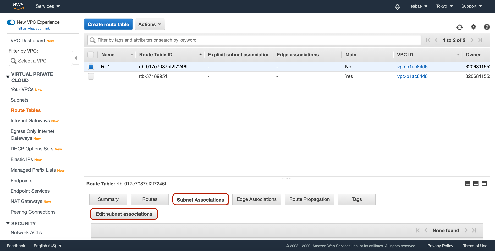

# Private Subnets and Bastion Hosts

지금까지 해온 것들
* 퍼블릭 서브넷에 인스턴스를 생성해 외부와 연결하기
* 시큐리티 그룹 룰을 설정해 접근을 제한하기
* 지금까지 배워온 것과 같이 모든 인스턴스를 외부에서 접근가능하도록 만드는 것은 보안 측면에서 이상적이지 않다

프라이빗 서브넷
* 사진에 보이는 것처럼 퍼블릭 서브넷은 기본적으로 라우트 테이블에 CIDR 블럭과 인터넷 게이트웨이 ID가 할당되어 있다
* 프라이빗 서브넷은 라우트 테이블에 인터넷 게이트웨이 아이디가 없다
* 프라이빗 서브넷에 생성된 인스턴스에는 퍼블릭 아이피도 없다
* 따라서 프라이빗 서브넷에 있는 인스턴스는 곧바로 외부 인터넷으로부터의 접근이 불가능하다
* 인터넷에서의 접근이 가능하게 하려면 바스티온 호스트(혹은 점프 호스트)를 사용해야 한다
* 바스티온 호스트란 위 그림에 있는 퍼블릭 서브넷에 위치한 인스턴스다
* 프라이빗 서브넷에 있는 인스턴스는 이 인스턴스(바스티온 호스트 혹은 점프 호스트)를 통해 외부와 간접적으로 통신할 수 있다

## 실습해보며 프라이빗 서브넷, 바스티온 호스트, 라우트 테이블 등을 사용해보기

라우트 테이블 만들기

* VPC 페이지로 이동해서 좌측에 있는 route table 탭을 클릭한다
* 그 다음 Create route table버튼을 눌러 새로운 라우트 테이블을 생성하는 화면으로 이동한다

* 네임태그에 이름을 입력하고 기본으로 제공되는 vpc를 선택한 후 Create버튼을 눌러 생성을 완료해주자

서브넷 만들기

* Subnet 탭으로 이동해 Create subnet 버튼을 누른다

* Name tag에 이름을 입력하고 기본으로 제공되는 VPC를 선택한다
* 서브넷은 반드시 서브넷이 소속될 Availability Zone(이하 AZ로 줄임)을 하나 선택해줘야 한다
  - 서브넷과 AZ는 항상 1:1관계이다
* CIDR block은 VPC CIDRs범위 안에서 지정해야 한다
* CIDR에 대해서는 조금 더 추가적인 설명이 필요하다

CIDR
* VPC에서 서브넷 탭을 누르면 IP4v4 CIDR을 확인할 수 있다

* 172.31까지는 공통이며 3번째 숫자가 0, 16, 32로 되어 있다
  - 아마 다음 서브넷은 48일 것으로 추정된다
* CIDR을 어떻게 계산하는지 정확히 알고 싶으면 다음 사이트를 참조하는 것이 좋다
  - https://www.calculator.net/ip-subnet-calculator.html

* Subnet 입력부분의 마지막 숫자를 자신의 VPC CIDR의 숫자와 일치 시킨다
* 그 다음 네번째 숫자가 가장 낮은 IPv4 CIDR 주소를 복사해 IP Address에 붙여넣고 Calculate버튼을 누른다

* 결과화면에서 스크롤을 약간 내려보면 ip 주소로 사용가능한 목록이 나온다
* 현재 보유하고 있는 ip를 감안하면 그 다음 서브넷의 이름으로 입력 가능한 ip는 172.31.48.0/20이 되어야 하므로 이를 복사한다

* 위 사진처럼 앞서 복사한 ip를 붙여넣고 Create버튼을 눌러 생성을 완료한다

한 개의 프라이빗 서브넷 더 만들기

* 앞서 만들었던 것과 같은 방식으로 네임과 AZ를 다르게 지정한 뒤 다음 순서의 CIDR block을 복사 붙여넣기 한 후 생성을 완료해준다

라우트 테이블과 새로 생성한 두 개의 서브넷 연결하기

* 라우트 테이블 탭으로 돌아가 앞서 생성했던 라우트 테이블을 선택한 후 아래에 있는 Subnet Associations탭을 누른다
* Edit subnet associations버튼을 눌러 연결 화면으로 이동한다

* 앞서 생성했던 두 개의 서브넷을 선택하고 Save버튼을 눌러 라우트 테이블과 연결을 완료한다

인스턴스 두개를 런칭하기
* 지금까지 생성해왔던 방식들과 똑같이 기본옵션들로 지정해준다
* 다만 서브넷을 지정하는 부분을 나눠 하나는 퍼블릭 서브넷의 인스턴스로 다른 하나는 위에서 생성한 프라이빗 서브넷의 인스턴스로 만들것이다
* 한 개의 인스턴스는 기존의 퍼블릭 서브넷 중 하나를 지정한다
* 한 개의 인스턴스의 서브넷은 앞서 생성했던 PrivateSubnet1로 지정해준다

* 시큐리티 그룹도 이전에 생성했었던 WebAccess로 지정한다

터미널로 퍼블릭 인스턴스에 접속하기
* 인스턴스 생성이 완료되면 퍼블릭 서브넷의 인스턴스의 IPv4 주소를 복사해서 접속한다

퍼블릭 인스턴스를 통해 프라이빗 서브넷의 인스턴스에 접속하기
* 클라이언트는 키페어 파일을 가지고 퍼블릭 서브넷에 접근할 수 있었다
* 그러나 퍼블릭 인스턴스에는 그런 키페어가 없다
* 프라이빗 서브넷의 인스턴스는 Private IP를 통해서만 접속할 수 있다
* 그러나 Private IP를 통해 접속하려면 먼저 키페어 파일을 이용해 권한을 추가해야 한다
* 우선 퍼블릭 서브넷 인스턴스의 연결을 종료하고 키페어 파일이 있는 폴더로 이용해 다음과 같은 CLI를 입력한다

* 다시 퍼블릭 서브넷에 연결하기

* 먼저 프라이빗 서브넷 인스턴스의 Private IP를 복사한다

* 퍼블릭 서브넷에서 프라이빗 서브넷 연결하기

* 이렇게 바스티온 호스트를 통해 프라이빗 서브넷에 연결하는 것을 에이전트 포워딩이라고 한다

아직 부족한 점
* 에이전트 포워딩을 통해 프라이빗 서브넷의 인스턴스에 연결까지는 성공했다
* 그러나 이는 외부에서 내부로의 통신, 즉 인바운드 트래픽에 한정된 이야기다
* 프라이빗 서브넷으로부터 외부로의 통신, 즉 아웃바운드 트래픽을 가능하게 하려면 NAT Gateway 혹은 NAT Instance 설정이 필요하다