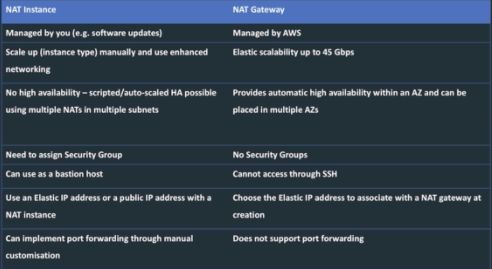
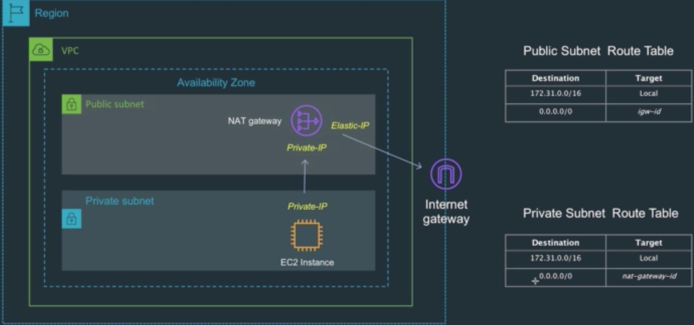
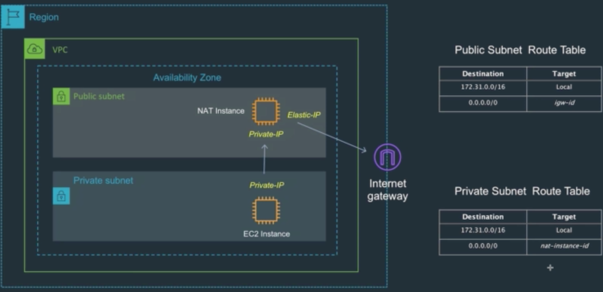

# NAT Instances and NAT Gateways Overview

앞서 살펴본 프라이빗 서브넷에 있는 인스턴스의 특징
* 기본적으로 직접 인터넷에 연결할 수 없다
* 퍼블릭 서브넷에 있는 호스트인 바스티온 호스트(혹은 점프 호스트)를 통해서만 연결이 가능하다
* 이런 구성으로도 충분히 대응 가능한 경우가 많지만 직접 프라이빗 서브넷과 연결이 필요한 경우도 있다
* 이렇게 직접 연결이 필요할 때 필요한 것이 NAT Gateway 혹으 NAT Instance다

NAT Gateway와 NAT Instance 비교

* NAT란 Network Address Translation의 약자로 프라이빗 아이피 주소를 퍼블릭 아이피 주소로 변환해 인터넷 연결을 가능하게 만드는 역할을 한다
* 위 표에 자세하게 나와 있듯이, NAT 서비스에서 Gateway와 Instance의 차이는 NAT작업에 대한 관리를 직접 하느냐 그렇지 않으면 AWS에 맡기느냐에 있다
* NAT Instance는 직접 EC2 인스턴스를 런칭해서 NAT가 가능하도록 설정해주어야 한다
* NAT Instance는 많은 것을 직접 관리해야 하는 낡은 방식(Old way)이지만 바스티온 호스트를 사용할 수 있는 점은 NAT Gateway에 비해 장점이라 할 수 있다

NAT Gateway Overview

* 위 그림에 보이는 것처럼 NAT Gateway를 퍼블릭 서브넷에 할당한 뒤
* 프라이빗 서브넷에 있는 인스턴스가 라우트 테이블을 통해 NAT Gateway를 참조하는 방식으로 사용할 수 있다
* 기억해야 하는 것은 프라이빗 서브넷에 있는 라우트 테이블은 NAT Instance는 참조할 수 없다는 것이다

NAT Instance Overview

* NAT gateway와 차이는 인스턴스를 직접 관리한다는 점이다
* 그 외의 라우트 테이블 등의 동작은 같다