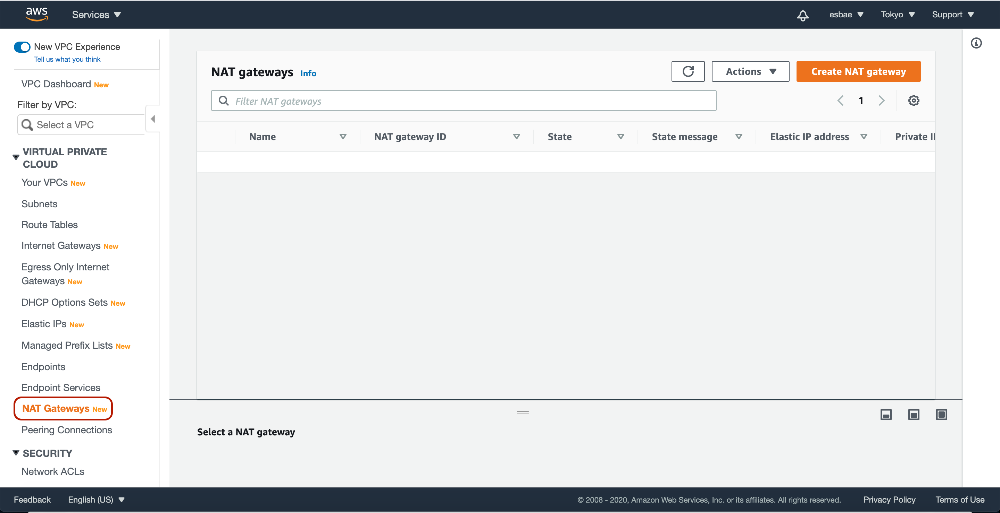
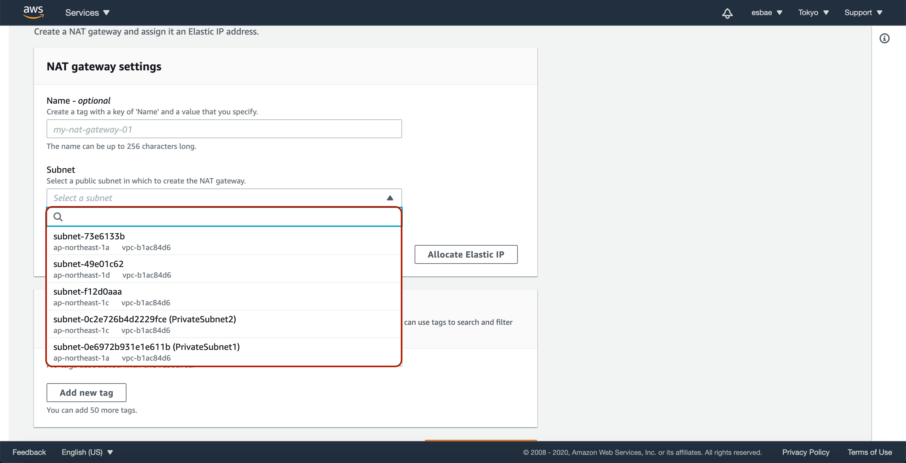
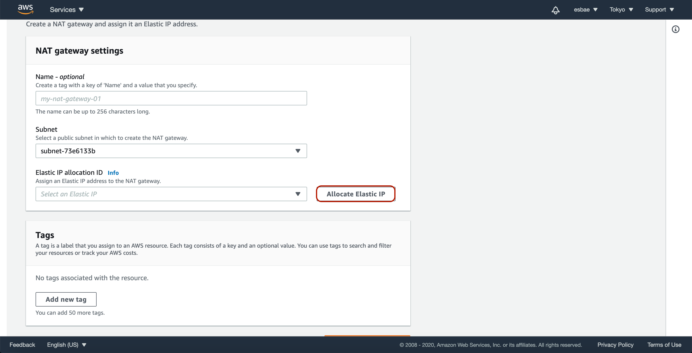
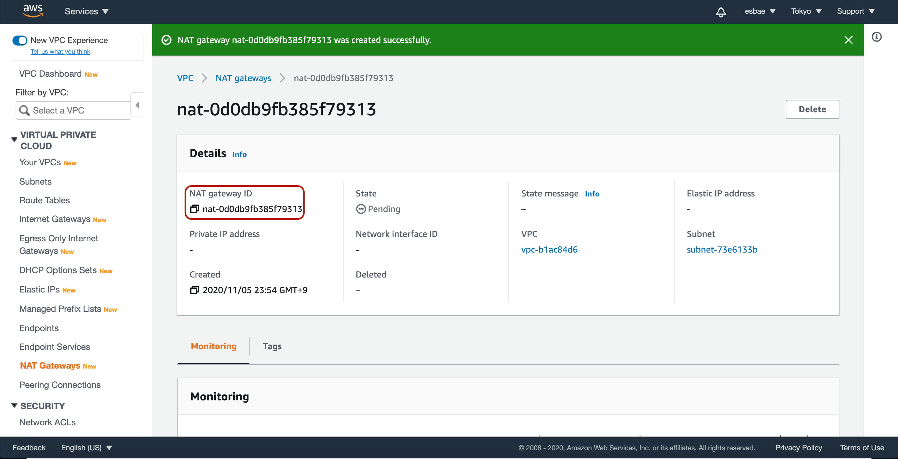

# Private Subnet with NAT Gateway

프라이빗 서브넷과 NAT Gateway
* 프라이빗 서브넷에 있는 인스턴스는 스스로 인터넷과 접촉할 수 없다
* 프라이빗 서브넷이 인터넷에 접속하기 위해서는 퍼블릭 서브넷에 있는 NAT Gateway를 거쳐야 한다
* NAT Gateway는 엘라스틱 아이피 어드레스를 가지며 외부 인터넷과 접속할 수 있다

NAT Gateway를 직접 생성해서 설정해보기

* 우선 VPC 대쉬보드에서 NAT Gateways 탭을 누른다
* 그러면 위 사진과 같이 NAT Gateway 목록이 나온다
* Create NAT gateway버튼을 클릭해 생성화면으로 이동한다

* 우선 원하는 대로 이름을 지정한다
* 주의해야 할것은 서브넷은 반드시 퍼블릭 서브넷으로 지정해야 한다는 점이다

* 기존에 엘라스틱 아이피가 있다면 해당 아이피를 사용하고
* 없다면 Allocate Elastic IP버튼을 눌러 할당해준다
* 할당을 완료하면 스크롤을 내린 후 Create a NAT Gateway 버튼을 눌러 생성을 완료한다

* 생성을 완료하면 NAT gateway ID가 생겨난 것을 볼 수 있다
* 이 ID가 라우트 테이블에 등록되어 통신에 사용될 것이다