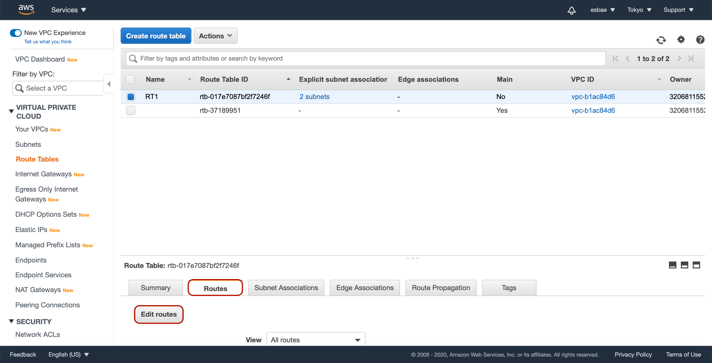

# Private Subnet with NAT Gateway

프라이빗 서브넷과 NAT Gateway
* 프라이빗 서브넷에 있는 인스턴스는 스스로 인터넷과 접촉할 수 없다
* 프라이빗 서브넷이 인터넷에 접속하기 위해서는 퍼블릭 서브넷에 있는 NAT Gateway를 거쳐야 한다
* NAT Gateway는 엘라스틱 아이피 어드레스를 가지며 외부 인터넷과 접속할 수 있다

NAT Gateway를 직접 생성해서 설정해보기

* 우선 VPC 대쉬보드에서 NAT Gateways 탭을 누른다
* 그러면 위 사진과 같이 NAT Gateway 목록이 나온다
* Create NAT gateway버튼을 클릭해 생성화면으로 이동한다

* 우선 원하는 대로 이름을 지정한다
* 주의해야 할것은 서브넷은 반드시 퍼블릭 서브넷으로 지정해야 한다는 점이다

* 기존에 엘라스틱 아이피가 있다면 해당 아이피를 사용하고
* 없다면 Allocate Elastic IP버튼을 눌러 할당해준다
* 할당을 완료하면 스크롤을 내린 후 Create a NAT Gateway 버튼을 눌러 생성을 완료한다

* 생성을 완료하면 NAT gateway ID가 생겨난 것을 볼 수 있다
* 이 ID가 라우트 테이블에 등록되어 통신에 사용될 것이다

* 앞서 만들었던 2개의 프라이빗 서브넷을 포함하고 있는 라우트 테이블을 선택한다
* 그런 다음 화면 아래의 라우트 탭에서 Edit routes버튼을 클릭한다

* 먼저 Add route버튼을 클릭한다
* 그 다음 위 사진과 같이 목적지에 0.0.0.0/0을 입력하고
* Target에는 생성한 NAT Gateway를 지정해준다
* Save routes버튼을 눌러 수정을 완료한다

* EC2로 가서 인스턴스 두개를 생성해준다
* 하나는 프라이빗 서브넷을 지정하고 다른 하나는 퍼블릭 서브넷을 지정해준다
* 시큐리티 그룹은 두 인스턴스 모두 앞서 생성했던 Web-Access를 지정한다 

* 터미널에서 우선 퍼블릭 서브넷에 있는 인스턴스에 접속한다

* 퍼블릭 서브넷에서 프라이빗 서브넷에 접속한다

* 구글로 핑을 날려보면 제대로 응답이 오는 것을 확인할 수 있다

실습 후 제거
* NAT Gateway와 Elastic IP는 제거하지 않으면 비용이 든다
* 우선 NAT Gateway를 제거한 뒤
* 제거가 완료되면 Elastic IP를 해제한다
  - NAT Gateway의 제거가 완료되기 전까지는 해제할 수 없다