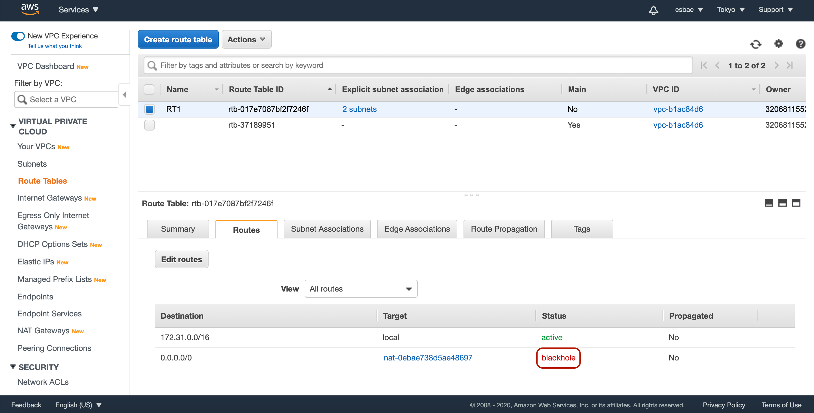

# Private Subnet with NAT Instance

NAT Instance를 사용해 외부와 통신하기
* 우선 앞서 생성했던 프라이빗 서브넷의 인스턴스는 남겨두고
* 퍼블릭 서브넷의 인스턴스는 Terminate해준다
* NAT Instance를 생성하기 위해 Running Instance화면에서 Create Instance버튼을 누른다

* NAT Instance는 기존의 Quick Start탭이 아닌 Community AMIs탭에 있는 인스턴스로 생성하는 것이 좋다
* 사진과 같이 Community AMIs탭에서 amzn-ami-vpc-nat를 검색하고
* amzn-ami-vpc-nat-hvm로 시작하는 인스턴스를 선택한다
* 퍼블릭 서브넷을 지정하고, Web-Access 시큐티리 그룹을 설정해 생성을 완료한다

* NAT Instance는 생성 후 몇가지 설정이 필요하다
* 우선 인스턴스를 선택 후 Actions -> Networking -> Chnage Source/Dest. check를 클릭한다

* EC2 인스턴스는 기본적으로 포트 포워딩이 불가능한데,
* NAT Instance는 포트 포워딩이 가능해야 하므로 이 설정을 변경시켜 주는 작업이다
* Yes, Disable버튼을 눌러 설정을 변경시킨다

* 포트포워딩을 위해 위와 같이 NAT Instance에 접속한다

* 프라이빗 서브넷의 인스턴스에 접속한다
* 지금 상태에서 구글에 핑을 날려보면 응답이 오지 않을 것이다
* 아직 라우트 테이블 설정을 하지 않았기 때문이다

* 다시 VPC의 라우트 테이블 탭으로 가서 프라이빗 서브넷의 라우트 테이블을 선택한다
* 화면 아래의 Routes탭을 눌러보면 앞서 제거했던 NAT Gateway라우트의 상태가 Blackhole로 되어 있음을 확인할 수 있다
* Edit routes버튼을 눌러 설정화면으로 들어가자

* NAT Gateway를 위해 설정했던 목적지는 삭제해주자

* NAT Instance의 인스턴스 ID를 복사한다

* 복사한 아이디를 Target에 입력하고 Save routes버튼을 눌러 설정을 완료한다

Web-Access가 모든 IPv4통신을 허용하도록 변경하기

* 시큐리티 그룹 탭으로 가서 Web-Access를 선택한다
* 화면 아래의 탭에서 Inbound탭을 누르고 Edit버튼을 클릭해 설정화면으로 이동한다

* Add Rule버튼을 누른뒤 타입은 All ICMP IPv4로 Source는 Anywhere로 선택한 후 Save버튼을 눌러 수정을 완료한다 

* 이제 프라이빗 서브넷에서 구글에 핑을 날려보면 정상적으로 응답이 오는 것을 확인할 수 있다

실습 종료 후 제거하기
* Web-Access에서 IPv4 설정을 삭제한다
* 생성했던 2개의 EC2 인스턴스를 삭제한다
* 라우트 테이블에 설정했던 라우트를 삭제한다