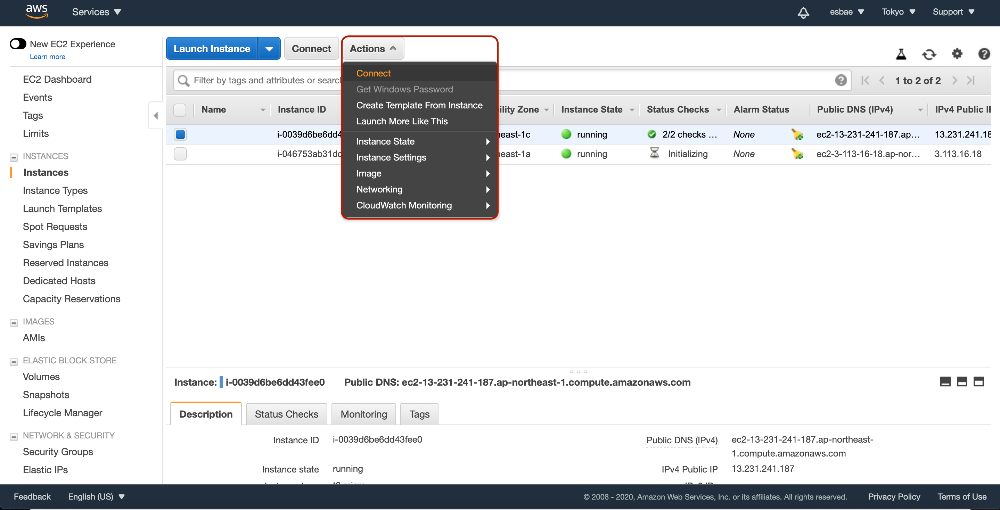
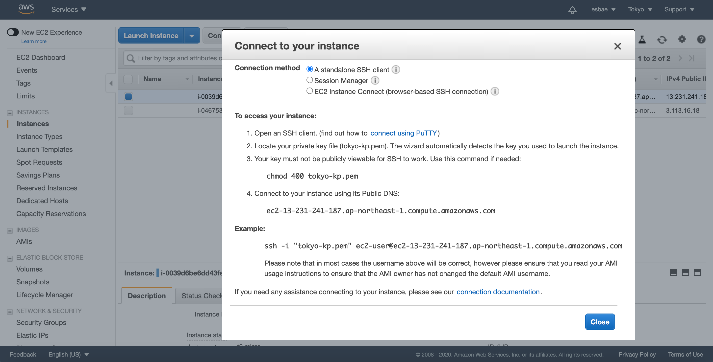
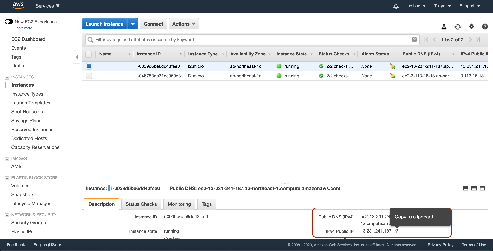
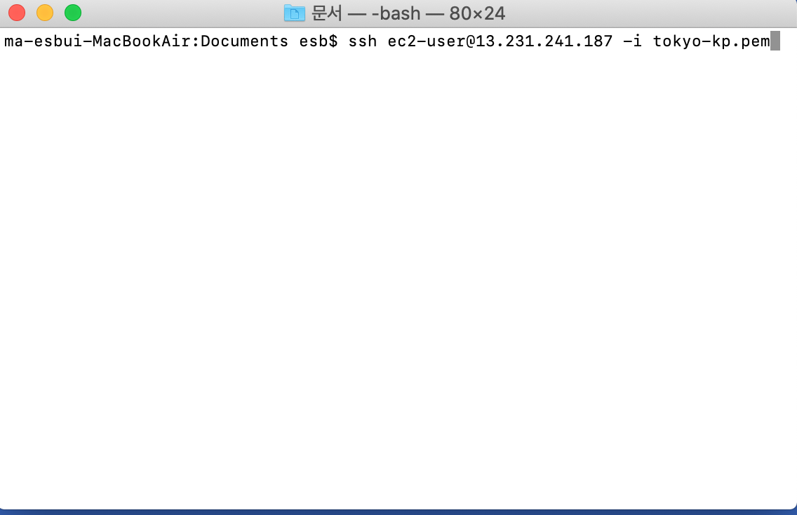
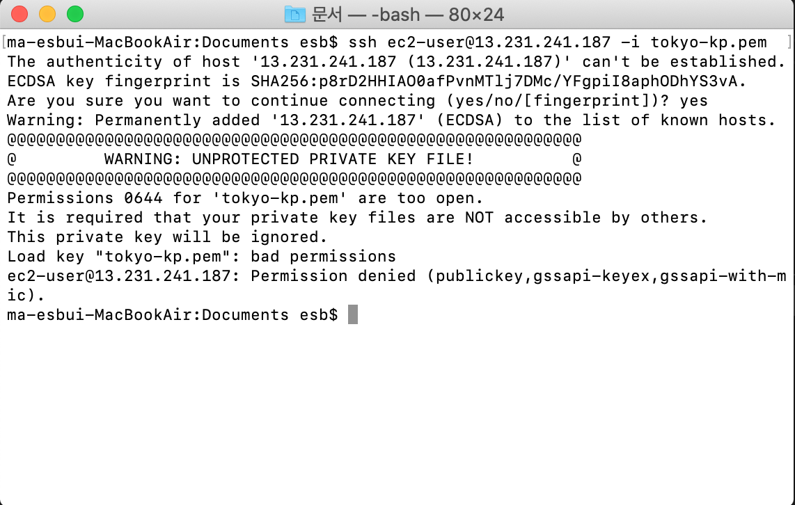
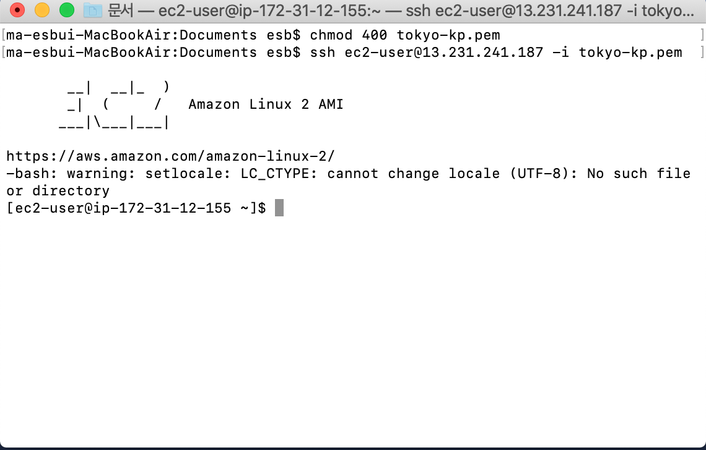
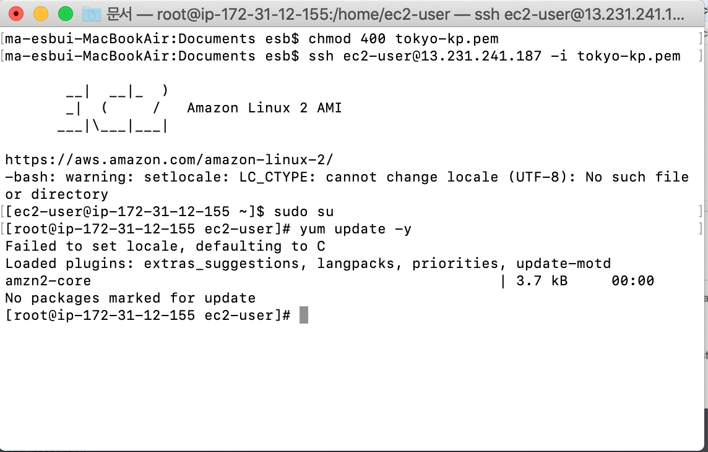
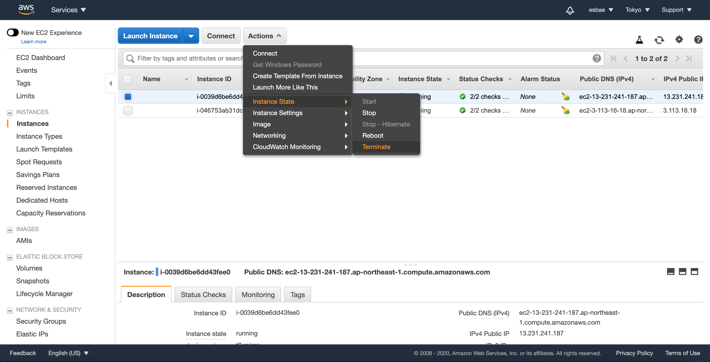

# Connect to Linux instance

리눅스 인스턴스와 연결하기

* 실행중인 인스턴스 목록에서 연결할 인스턴스를 지정한다
* Action버튼을 누르고 드롭다운 목록에서 Connect를 클릭한다
* 그럼 다음과 같은 화면이 나올 것이다

* 여기서는 기본 SSH 클라이언트 방법을 사용한다
  - 맥의 경우 SSH 연결을 위한 프로그램이 기본적으로 갖춰져 있다
  - 그러나 운영체제에 따라서는 추가적인 프로그램을 설치해야 한다
* 연결방식을 확인했으면 Close버튼을 눌러 창을 닫고 다음과 같이 해당 인스턴스의 ip주소를 복사해준다

* 그런 다음 터미널을 열고 키페어가 있는 경로에서 다음과 같은 CLI를 입력해준다
  - 키페어 파일의 이름이 다르다면 해당 파일의 이름으로 변경해야 한다

* 그러나 안전하지 않은 키페어 파일로 인식되어 접근이 거부되고 있음을 확인할 수 있다

* 이는 앞서 Actions탭에서 connect를 눌렀을 때 나왔던 모달에 있는 절차를 거치지 않았기 때문에 발생한 것이다

* 위와 같이 앞서 모달에 나와있던 절차를 이행한 후 다시 CLI를 입력하면 인스턴스에 성공적으로 연결되는 것을 확인할 수 있을 것이다

* 평소 리눅스 서버를 관리할 때와 마찬가지로 관리자 권한을 가지고 모든 작업을 수행할 수 있다
* 동작을 확인했으면 인스턴스를 삭제해주자

윈도우즈 운영체제에서 아마존 리눅스 인스턴스 연결하기
* putty라는 프로그램을 사용해야 한다
* 이 부분은 필요할 때 강의를 다시 보는 것이 나을 것이다