# Connect to Linux instance

윈도우즈 인스턴스와 연결하기
* 리눅스 인스턴스의 연결방법을 확인하던 때와 마찬가지로 Actions 탭을 누르고 connect를 클릭한다
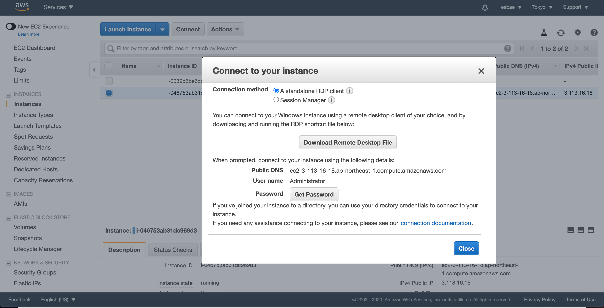
* 모달을 보면 리눅스 인스턴스와는 다르게 RDP라는 옵션을 이용해야 함을 알 수 있다
* RDP를 사용하기 위해서는 패스워드가 필요하다
* 모달의 중앙에 있는 Get Password 버튼을 누른다
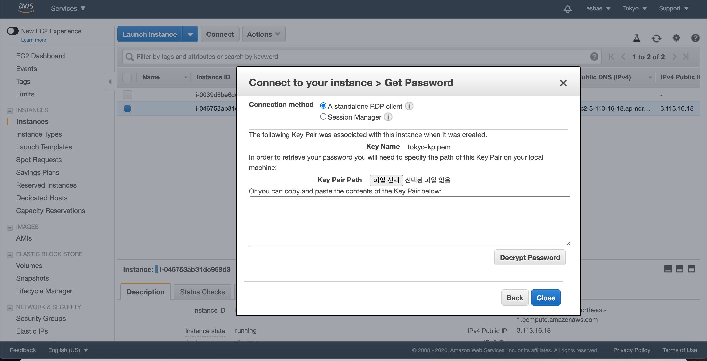
* 위와 같은 화면으로 모달의 내용이 변경되어 있음을 확인할 수 있다
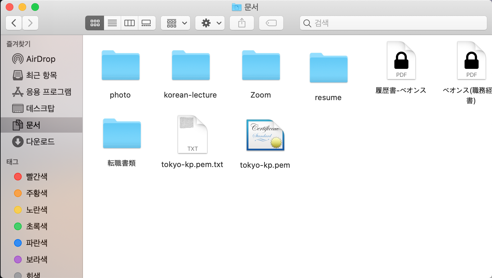
* 키페어 파일(.pem)의 형식을 txt로 바꾸고 실행해보면 다음과 같이 암호화되어 있는 내용을 확인할 수 있다
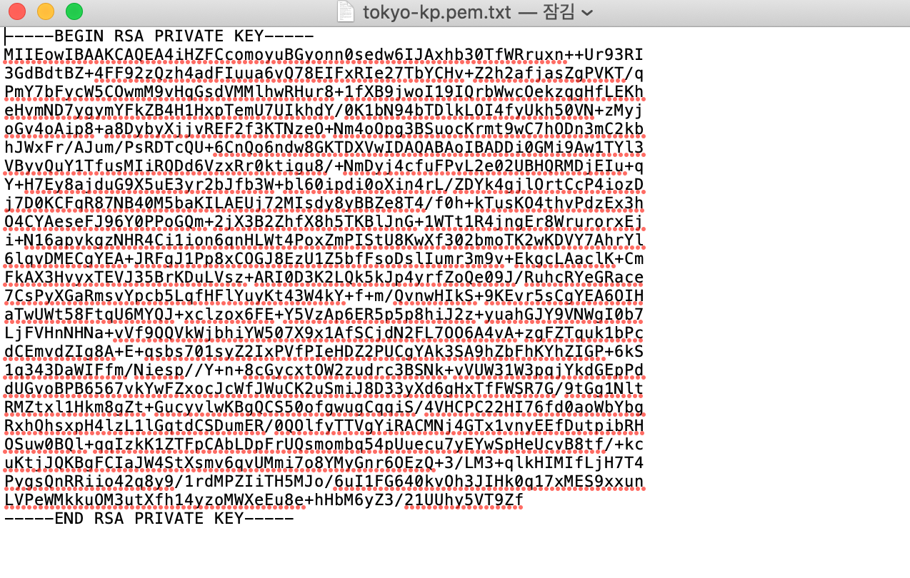
* 내용을 복사해 모달 중앙에 있는 폼에 집어넣고 Decrypt Password버튼을 클릭해주자
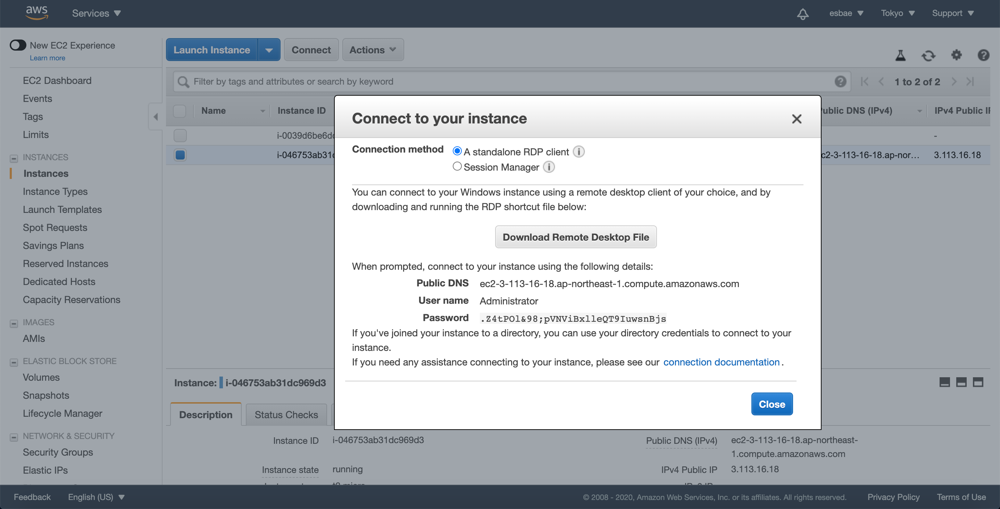
* 위와 같이 모달의 내용이 변경될 것이다
* 모달 중앙에 있는 패스워드를 복사한다
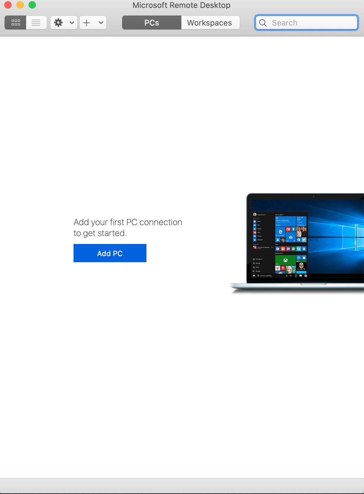
* 맥에서는 윈도우즈 인스턴스에 연결할 때 Microsoft Remote Desktop라는 프로그램을 사용한다
* Add PC 버튼을 누른다
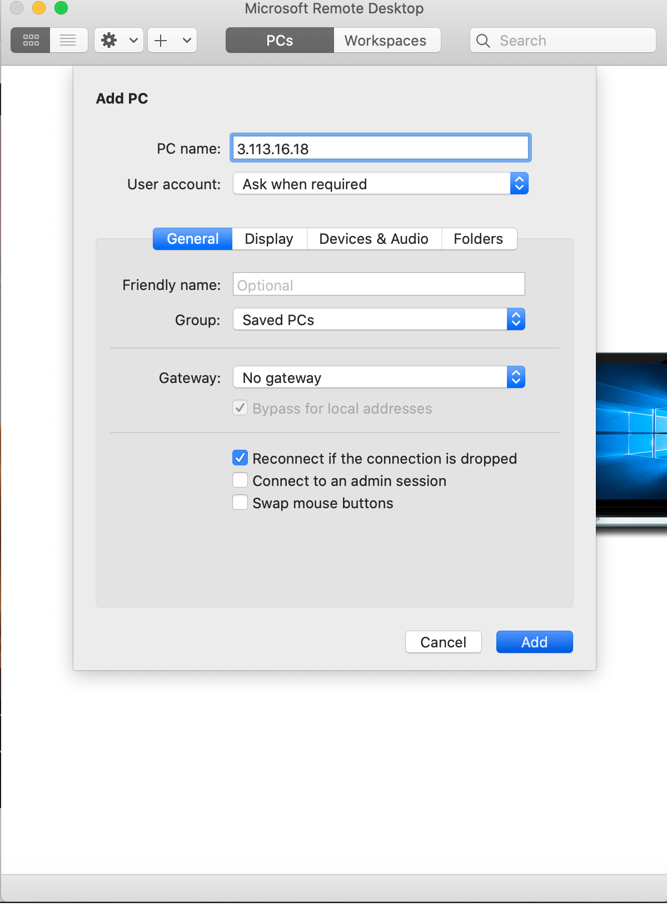
* PC name에 윈도우즈 인스턴스의 ip주소를 입력하고 Add버튼을 누른다
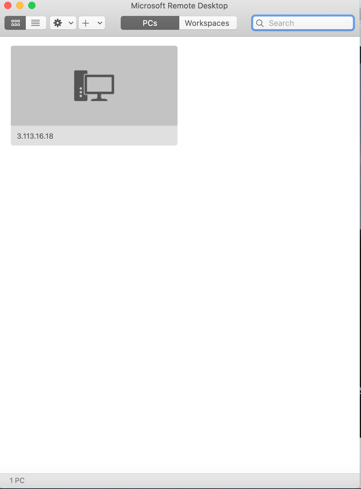
* 위와 같이 원격으로 접근할 수 있는 pc가 생긴 것을 확인할 수 있을 것이다
* 더블클릭해서 pc에 접근해보자
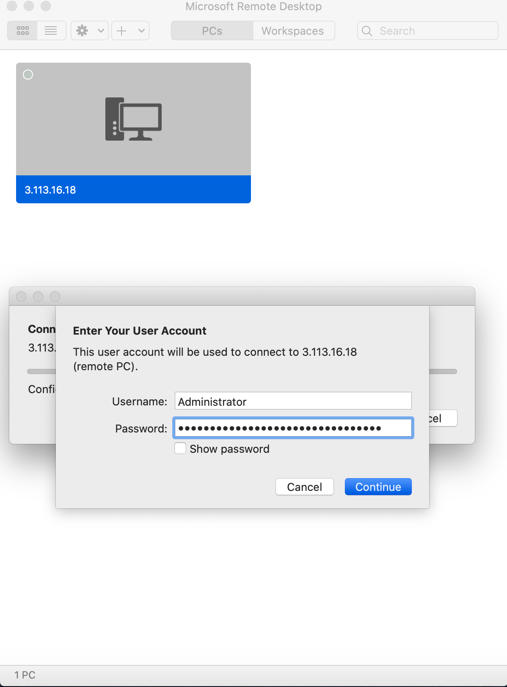
* Username은 Administrator를 입력하고 패스워드는 앞서 얻었던 패스워드를 입력하자
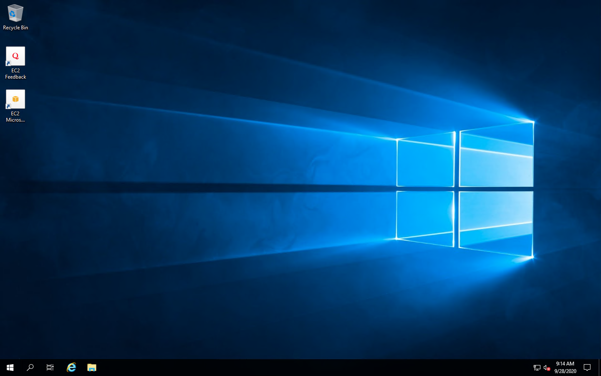
* 이로써 윈도우즈 인스턴스를 사용할 수 있게 됐다

인스턴스 삭제하기
* 계속 생성해두면 과금이 되므로 리눅스 인스턴스와 마찬가지로 삭제해두자
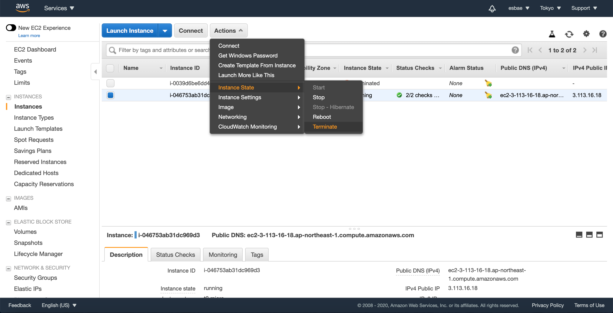