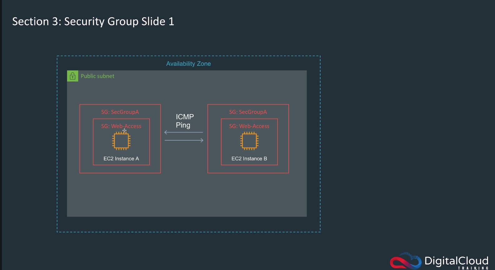
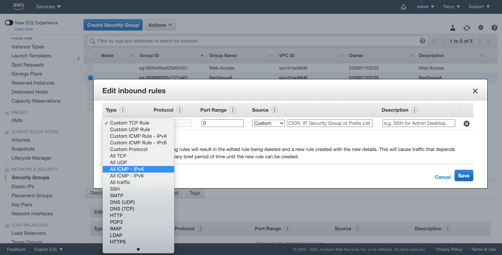
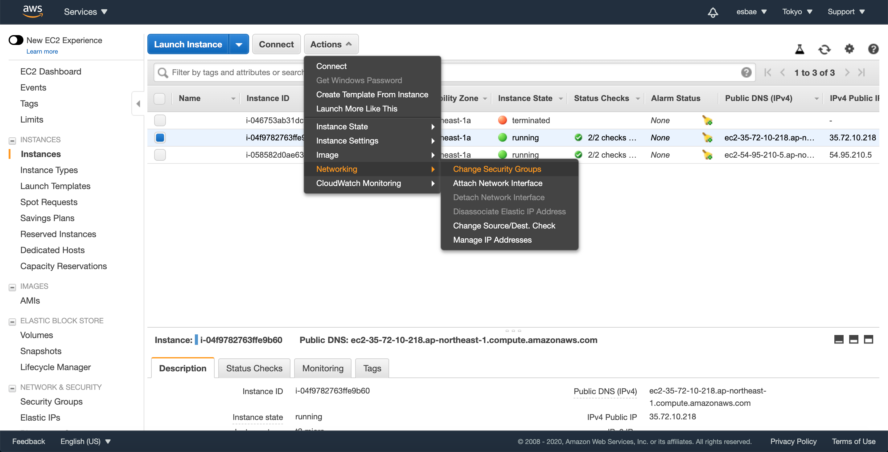

# Security Group Lab

시큐리티 그룹
* 시큐리티 그룹은 인스턴스 레벨에서의 방화벽 역할을 수행한다
* 여러 개의 인스턴스를 같은 시큐리티 그룹으로 묶어서 관리할 수 있다

* 위와 같이 인스턴스 A, B는 Web-Access라는 동일한 시큐리티 그룹 안에 있을 수 있다
* 사진처럼 동일한 시큐리티 그룹 안에서는 ICMP핑을 주고 받는 등의 통신을 할 수 있다
* 시큐리티 그룹은 스테이트풀한 정책을 가지고 있다
  - 인바운드 연결을 허가하면 리스폰스 커넥션은 언제든 허가된다
  - 지금은 모호하게 들리겠지만 차후 자세히 설명한다

인스턴스 생성하기
* 앞서 Linux 인스턴스를 생성하던 내용을 참고해서 2개의 EC2 리눅스 인스턴스를 생성한다
* 다른 모든 옵션은 기본 옵션으로 하되(서브넷 포함 전부 기본옵션) 다음과 같이 Configure instance Details화면에서 인스턴스 갯수만 2개로 설정해준다

* 시큐리티 그룹은 앞서 생성했던 Web-Access시큐리티 그룹으로 지정한다

2개의 인스턴스에 연결하기

* 위와 같이 첫 번째 인스턴스에 연결하자
  - 잘 모르겠으면 ec2-connect-linux-instance.md 파일을 참조

* 같은 방식으로 두 번째 인스턴스에 연결하기

첫 번째 인스턴스에서 두 번째 인스턴스로 핑을 보내기

* 두 번째 인스턴스에서도 똑같이 첫 번째 인스턴스로 핑을 보내보자
* Control + C 키로 핑을 종료하면 다음과 같은 결과가 양쪽 인스턴스 모두에서 발견될 것이다

* 이는 Web-Access라는 시큐리티 그룹을 생성만 했을 뿐 어떤 작업도 허가하지 않았기 때문이다

시큐리티 그룹 설정하기
* 다음과 같이 브라우저에서 시큐리티 그룹 화면으로 이동한다

* Create Security Group 버튼을 누르고 다음과 같이 새로운 시큐리티 그룹을 생성한다

* 위의 방식으로 SecGroupA, SecGroupB라는 2개의 새로운 시큐리티 그룹을 생성한다

* SecGroupA를 선택한 다음 아래의 인바운드 탭을 누르고 Edit 버튼을 누른다

* ping과 관련된 타입인 ICMP-IP4를 선택한다

* Source 폼에 sg를 입력하면 자신의 시큐리티 그룹 목록이 나온다
* SecGroupA를 선택해 SecGroupA 시큐리티 그룹 안에 있는 인스턴스 끼리는 Ping을 이용한 통신이 가능하도록 해준다

인스턴스에 시큐리티 그룹 적용하기
* 위에서 생성한 SecGroupA를 생성해 두었던 인스턴스 2개에 적용해주자

* 위 사진과 같이 각각 인스턴스를 선택한 상태로 진행한다

* SecGroupA 체크박스를 클릭한 후 Assign Security Groups 버튼을 누른다
* 두번째 인스턴스에도 같은 작업을 수행한다

* 앞서 했던 것과 똑같이 두 개의 인스턴스가 서로에게 핑을 보내도록 해본다
* ICMP 인바운드 트래픽을 허용하는 시큐리티 그룹에 두 인스턴스가 속해 있으므로 정상적으로 통신이 이루어지고 있다
* 두 번째 인스턴스의 시큐리티 그룹을 SecGroupB로 바꾸고 다시 핑을 보내보면 통신이 불가능해진 것을 확인할 수 있을 것이다

다른 시큐리티 그룹으로 부터의 통신을 허용해보기
* 앞선 예제와 같이 같은 시큐리티 그룹 내에서만 통신을 허용하는 경우도 있지만 다른 특정 시큐리티 그룹과의 통신이 필요할 때도 있다

* 앞서 진행했던 인바운드 룰을 수정하는 방식과 똑같이 수행한다
* Source폼에 자기 자신이 아닌 SecGroupB를 선택하는 부분만 다르다
* 이제 SecGroupB가 적용되어 있는 두 번째 인스턴스에서 첫 번째 인스턴스로 Ping을 보내보자
* 반대로 첫번째 인스턴스에서도 두 번째 인스턴스로 Ping을 보내보자

* SecGroupB로부터의 ICMP-IP4 인바운드 트래픽을 허용하는 SecGroupA를 사용중인 첫 번째 인스턴스로의 핑은 정상적으로 동작한다
* 그러나 어떠한 인바운드 트래픽 룰도 없는 SecGroupB를 사용중인 두 번째 인스턴스로의 핑은 동작하지 않는다
* SegGroupB의 안바운드 룰을 SecGroupA로부터의 ICMP-IP4 타입의 트래픽을 허용하도록 변경하고 다시 핑을 날려보자

* 이제 양방향으로 핑을 이용한 통신이 가능함을 확인할 수 있을 것이다

# 실습을 끝냈으면 인스턴스를 터미네이트 하는 것을 잊지 말자!!!!

실습을 위해 생성했던 SecGroupA와 SecGroupB도 삭제해주자
* 참고로 시큐리티 그룹을 삭제하려면 룰을 전부 삭제한 뒤에야 삭제가 가능해진다