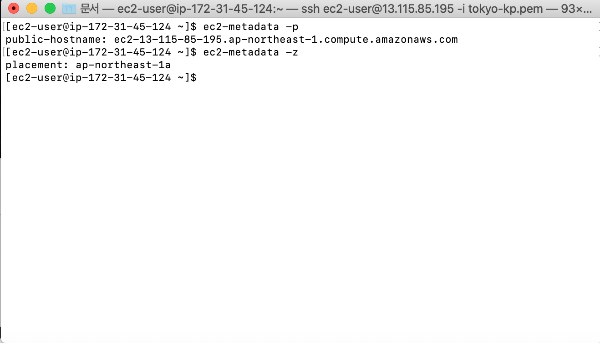

# Instance Metadata

인스턴스 메타데이터
* 인스턴스 메타데이터란 '실행중인 인스턴스'를 설정하고 관리하는 데 사용가능한 데이터다


* 빨간 박스 안에 있는 주소를 복사해두자
* curl을 통해 메타데이터를 확인해볼 것이다
* 전부 기본 옵션으로 새로운 아마존 리눅스 인스턴스를 하나 생성하고 연결한 후 다음 CLI를 입력해보자


* 반드시 엔드포인트 끝에 슬래시(/)를 붙여야 하는 점을 주의하자


* 메타데이터 중 public-hostname을 엔드포인트 끝에 붙이면 인스턴스의 퍼블릭 호스트네임이 앞에 붙는다


* 호스트네임과 마찬가지로 퍼블릭 ipv4를 사용하면 앞에 ipv4가 붙는다


* 로컬 호스트네임도 볼 수 있다
* 이와 같은 방식으로 인스턴스에 관한 내용들을 사용할 수 있다

메타데이터에 접근하는 다른 방법

* 위와 같은 커맨드를 입력하면 ec2-metadata라는 파일을 다운받는다
* 다운받은 파일에 바로 접근은 불가능하므로 chmod u+x 커맨드를 이용해 접근한다


* 빨간 상자 안에 있는 cli를 입력하면 확인할 수 있는 메타데이터 목록과 커맨드가 나온다
```terminal
$ ec2-metadata (option)
```
* 위와 같은 형식으로 사용하고 싶은 메타데이터 커맨드를 입력할 수 있다


* 퍼블릭 호스트네임, 리전을 확인하는 커맨드다
* -help로 메타데이터 목록을 확인해가며 사용하고 싶은 메타데이터를 상황에 맞게 입력하자