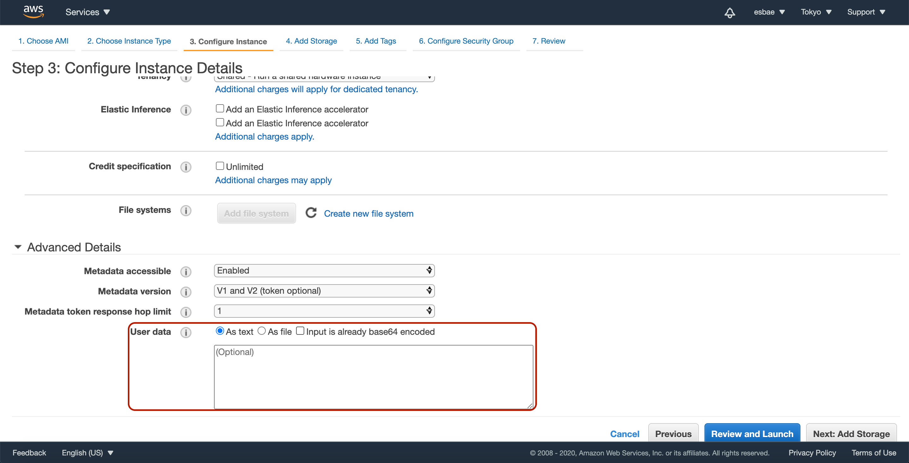
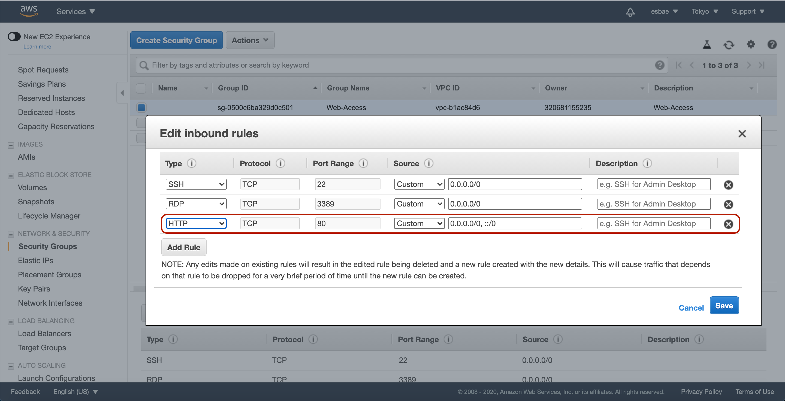
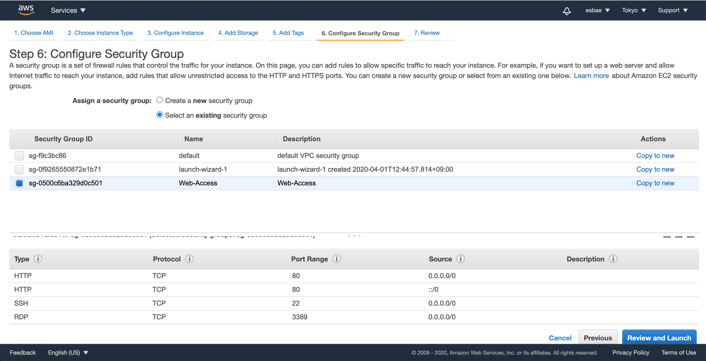
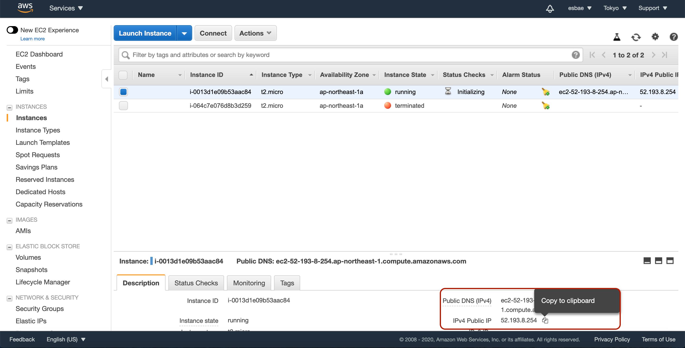
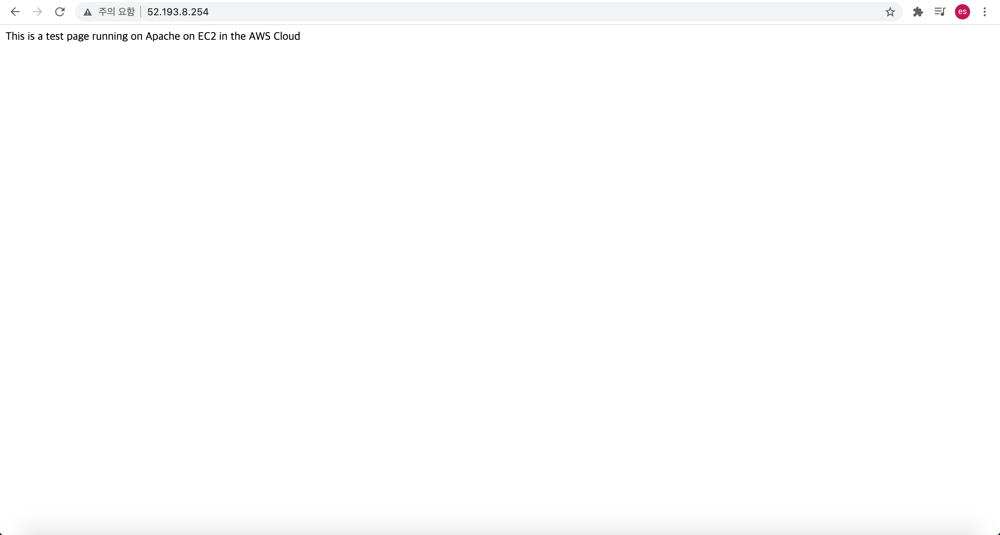
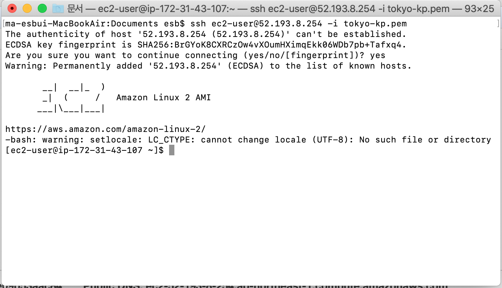
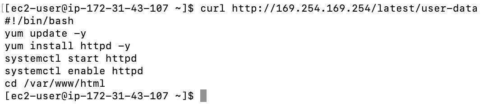

# Instance Userdata

인스턴스 유저데이터
* 유저데이터는 인스턴스가 부팅될 때 실행될 때 넘겨주는 데이터다
* CLI같이 부팅후에 자동적으로 실행되길 원하는 정보를 넘겨주는 것이 보통이다
* Launch Instance 버튼을 눌러 새로운 인스턴스를 생성하는 화면으로 이동하자


* 3번째 화면인 Configure Instance 화면에서 스크롤을 아래로 내리면 유저데이터를 입력할 수 있는 란이 나온다

```txt
#!/bin/bash
yum update -y
yum install httpd -y
systemctl start httpd
systemctl enable httpd
cd /var/www/html
echo "This is a test page running on Apache on EC2 in the AWS Cloud" > index.html
```
* 위 텍스트를 폼에 입력하자


* 넥스트 버튼을 눌러 다음 설정으로 이동한다
* 스토리지와 태그 설정은 기본 옵션으로 둔 채 시큐리티 그룹 설정으로 넘어가자


* 새로운 탭을 열고 ec2 서비스 화면에서 시큐리티 그룹 설정으로 이동한다
* 그 다음 Web-Access시큐리티 그룹의 인바운드 설정을 Edit버튼을 눌러 다음과 같이 HTTP통신을 허용하도록 룰을 추가하고 저장한다


* 그런 다음 다시 인스턴스를 생성하던 탭으로 돌아와 Web-Access 시큐리티 그룹을 선택하고 인스턴스 생성을 완료해준다


* 인스턴스 런칭이 완료되면 ip주소를 복사하고 브라우저에 입력해서 접속해보자


* 앞서 유저데이터에서 아파치를 설치하고 경로에 맞게 index.html에 입력했던 문구가 보이는 것을 확인할 수 있다


* ssh를 이용해 인스턴스에 연결해보자


* 앞서 메타데이터와 유사하게 유저데이터도 확인할 수 있다