# Status Checks and Monitoring

ec2 인스턴스의 상태를 체크하기
* 앞서 유저데이터 장에서 사용했던 인스턴스를 활용한다
* 인스턴스 목록에서 특정 인스턴스를 선택하고 화면 중앙 아래 쪽에 있는 Status Checks 탭을 누른다

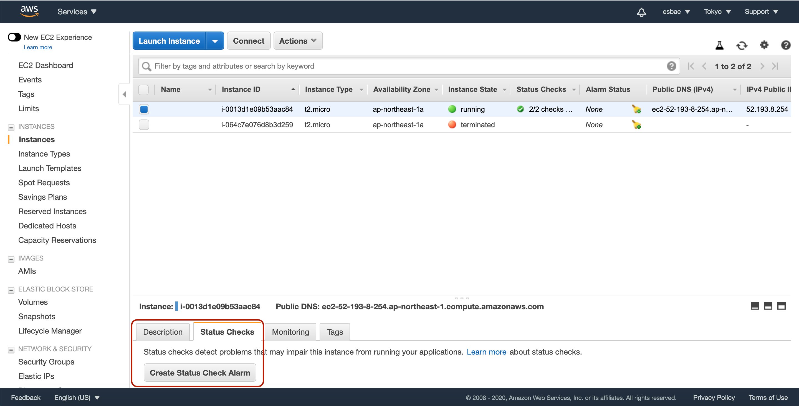
* Status checks 알람을 활용하면 매분마다 인스턴스의 상태를 체크해 pass 혹은 fail로 인스턴스의 상태를 알려준다
* 모든 상태체크가 패스되면 인스턴스의 상태는 괜찮은 것이다
* 하나 혹은 하나 이상의 상태체크가 실패하면 장애가 있는(impaired) 것으로 판단한다
* 상태체크는 두 종류로, 시스템 상태 체크와 인스턴스 상태 체크로 나뉘어져 있다
* 시스템 상태 체크는 AWS 자체의 상태(AWS의 전원, 네트워킹, 소프트웨어 시스템 등)를 체크하는 것으로 문제가 있을시 AWS측에서 트러블슈팅을 해야 한다
* 인스턴스 상태 체크는 운영체제를 포함해 유저의 작업에 문제가 있는지 체크하는 것으로 문제가 있을시 유저가 트러블슈팅을 해야 한다

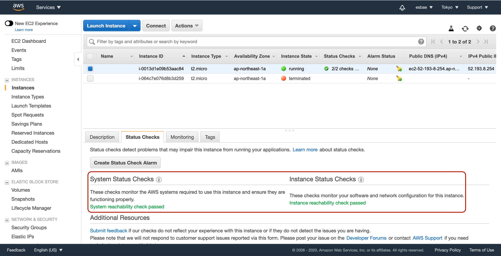
* i아이콘에 마우스를 올려놓으면 각각의 상태체크에 관한 자세한 설명을 볼 수 있다

모니터링
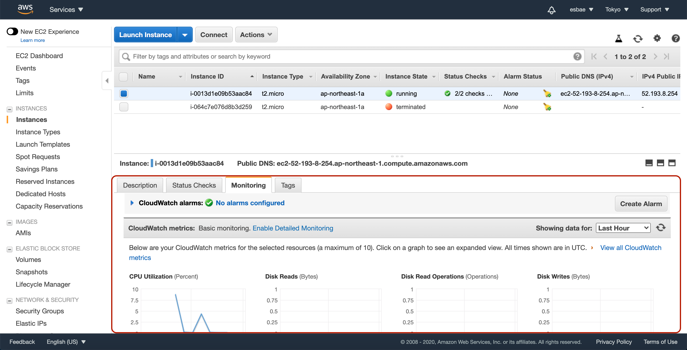
* Cloudwatch라는 서비스를 이용해 인스턴스에 관한 각종 지표를 확인할 수 있다
* 스크롤을 좀 더 내려보면 다음과 같이 다양한 지표들이 나온다

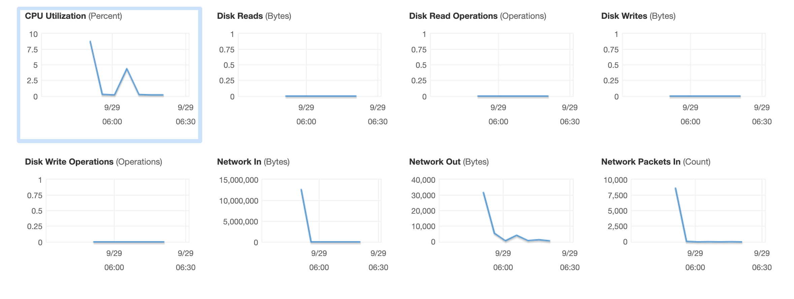

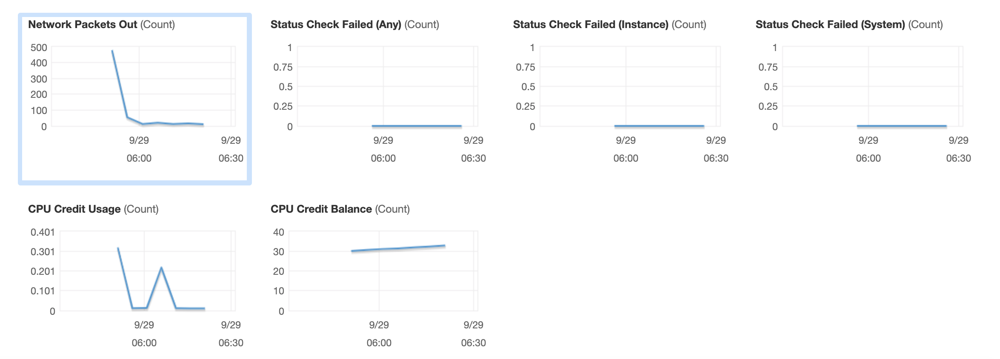

모니터링의 종류
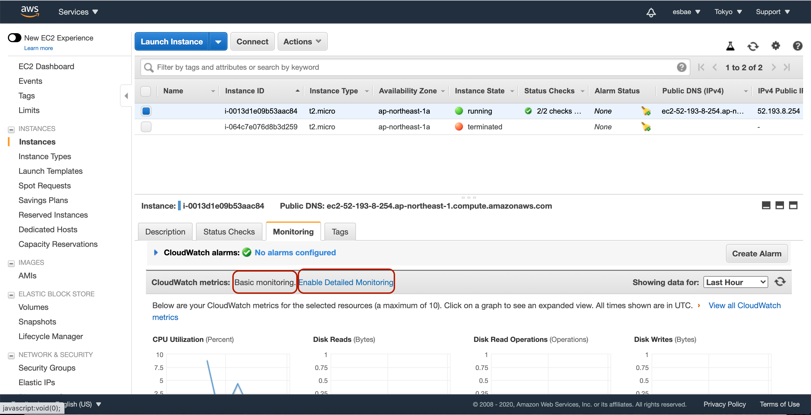
* 베이직 모니터링은 5분에 한 번씩 모니터링을 실시한다
* 디테일 모니터링은 1분에 한 번씩 모니터링을 실시한다
* Enable Detailed Monitoring을 클릭하면 다음과 같은 모달이 나온다

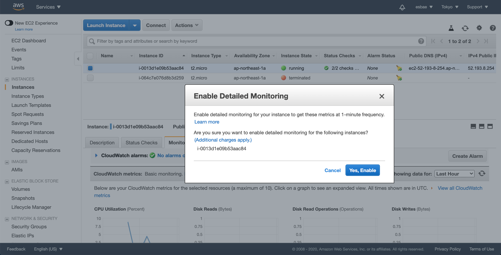
* 디테일 모니터링을 활성화하면 추가적인 과금이 발생하므로 주의하자
* 여기서는 활성화하지 않는다

알람을 설정해 CPU 사용량의 변경을 체크하기
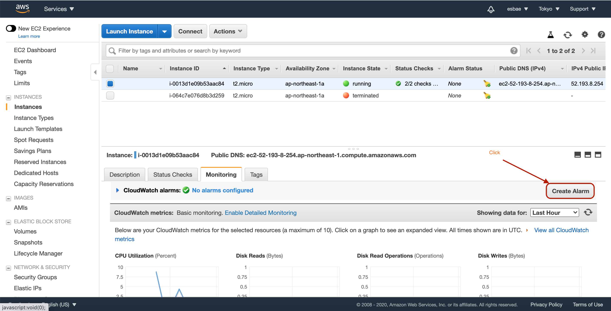
* 모니터링 탭 화면 우측에 Create Alarm 버튼을 클릭한다

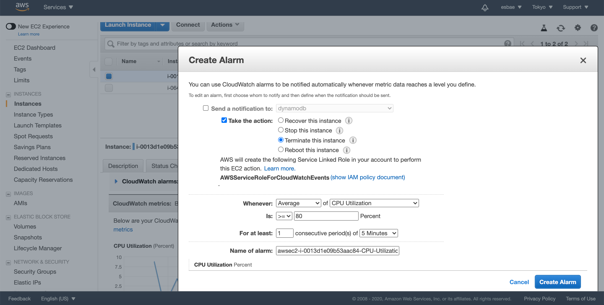
* CPU사용량이 80%이상이 되면 인스턴스를 제거하는 액션을 수행하도록 알람을 설정하고 있다
* 설정을 입력한 후 Create Alarm버튼을 클릭해 알람생성을 완료하자

인스턴스에 접속해 CPU사용량을 늘려 테스트해보기
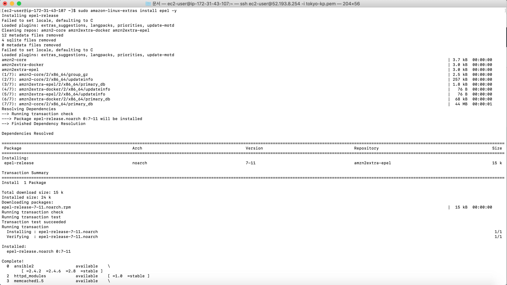
* 위의 커맨드를 입력해 CPU에 스트레스 테스트를 하기 위한 도구를 설치한다

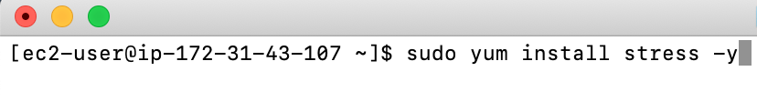
* 위의 커맨드도 추가로 입력해준다

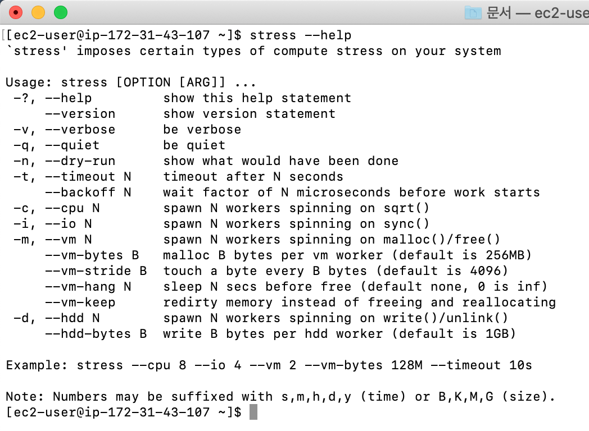
* 위 커맨드를 통해 스트레스 툴의 옵션들을 확인할 수 있다

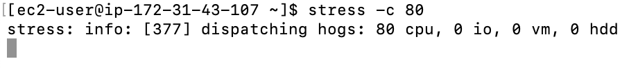
* 위 커맨드를 사용하면 cpu사용량이 80% 이상이 된다
* 커맨드를 입력한 후 모니터링 화면으로 돌아가서 무슨 일이 일어나는지 확인해보자

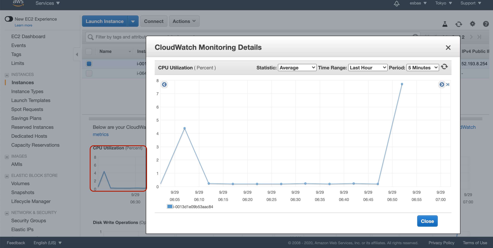
* 빨간 상자에 있는 CPU사용량표를 클릭하면 위와 같이 모달이 뜨면서 자세한 내용을 볼 수 있다

클라우드와치에서 알람확인하기
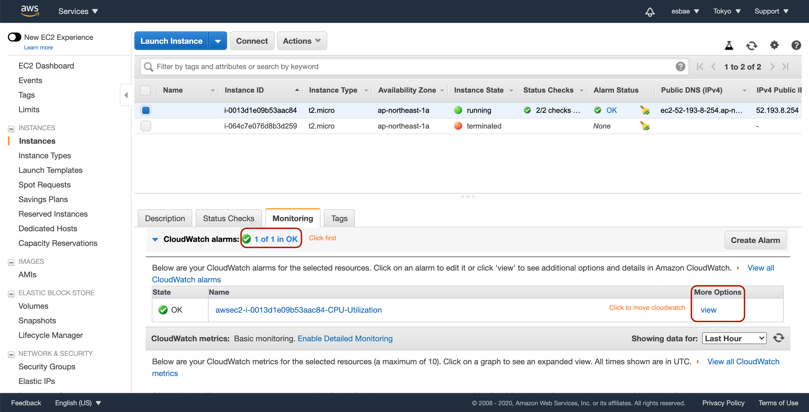
* 위 화면처럼 알람 목록을 띄운 후 view를 클릭해 클라우드와치에서 알람에 관한 자세한 정보를 보기 위해 이동하자

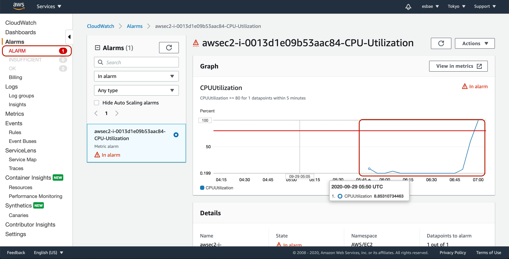
* 위와 같이 앞서 설정해놓았던 알람 기준을 초과하면 화면 좌측 빨간상자처럼 ALARM탭에 숫자가 추가된다
* 만약 CPU사용량이 80퍼를 넘지 않았다면 OK탭에 숫자가 추가되어 있었을 것이다

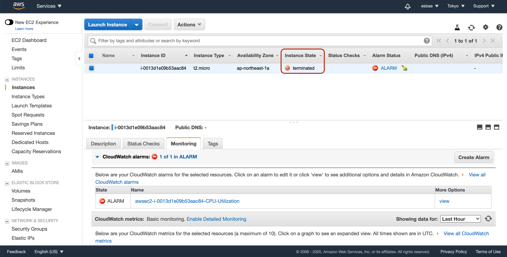
* 다시 ec2 인스턴스 목록으로 돌아가서 확인해보면 알람에 설정해놓았던 액션대로 인스턴스가 제거되어 있는 것을 확인할 수 있다