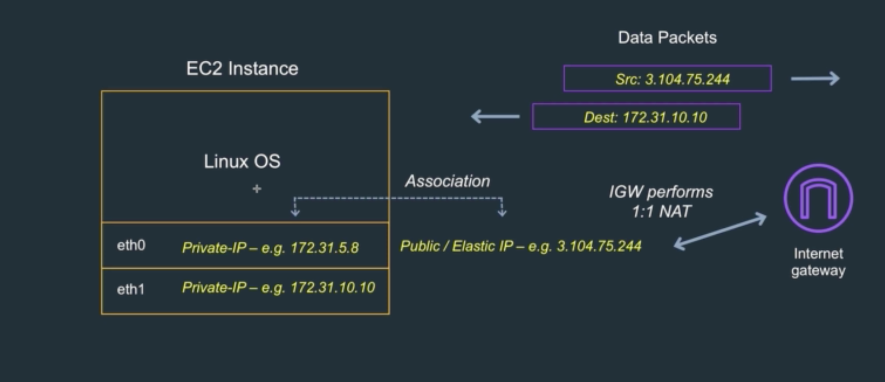

# Public, Private and Elastic IP Addresses Overview

Public IP Address
* 인스턴스가 정지될 때 사라진다
* 따라서 인스턴스를 리부트하면 새로운 퍼블릭 아이피 주소를 얻게 된다
* 퍼블릭 서브넷에서 사용한다
* 엘라스틱 아이피와 마찬가지로 외부와 연결할 때 사용한다
* 퍼블릭 서브넷과 퍼블릭 아이피 어드레스는 무료로 제공된다
* EC2 인스턴스에 있는 프라이빗 아이피 어드레스와 연관되어 있다
  - 이는 엘라스틱 아이피 어드레스도 마찬가지다

Private IP Address
* 인스턴스가 정지되어도 아이피는 보존된다
* 인스턴스가 퍼블릭 서브넷에 있든 프라이빗 서브넷에 있든 인스턴스는 프라이빗 아이피 어드레스를 가진다
  - 프라이빗 어드레스는 운영체제가 알고 있는 것이기 때문이다

Elastic IP Address
* 정적 아이피 어드레스로 사용하려면 비용을 지불해야 한다
  - 인스턴스가 중지되어도 비용을 지불해야 한다
* 엘라스틱 아이피 주소로 요청을 보내면 연관된 인스턴스의 작업을 처리하는 방식으로 많이 사용된다
* EC2 인스턴스에 있는 프라이빗 아이피 어드레스와 연관되어 있다

* 위 그림처럼 리눅스가 설치된 EC2 인스턴스가 있다고 가정하자
* 인스턴스는 두 개의 이더넷을 가지고 있다
* 두 개의 이더넷은 각각 프라이빗 아이피 어드레스를 가지고 있다
* 이 중 eth0의 프라이빗 아이피 어드레스는 퍼블릭 혹은 엘라스틱 아이피 어드레스와 연결되어 있다
* 리눅스 인스턴스는 오직 자신이 가지고 있는 이더넷의 프라이빗 아이피 어드레스만 알고 있다
  - 퍼블릭, 엘라스틱 아이피 어드레스는 알지 못한다
* AWS가 인스턴스의 프라이빗 아이피 어드레스와 퍼블릭 혹은 엘라스틱 아이피 어드레스를 매핑시켜주는 것이다
* AWS에 의해 프라이빗 아이피 어드레스와 매핑된 퍼블릭 혹은 엘라스틱 아이피는 다시 외부와 통신을 위해서 인터넷 게이트웨이와 1:1로 네트워크 주소 변환을 거친다
* 전체 흐름을 다시 설명하자면 다음과 같다
  - 외부에서 퍼블릭 혹은 엘라스틱 아이피 어드레스로 요청이 들어온다
  - 인터넷 게이트웨이는 퍼블릭 혹은 엘라스틱 아이피 어드레스와 매핑되어 있는 프라이빗 아이피 어드레스로 요청을 보낸다
  - 해당 프라이빗 아이피 어드레스를 보유한 인스턴스는 요청에 따른 처리를 수행한다
  - 이는 외부에서 내부로 요청이 들어오는 인바운드 트래픽 처리에 대한 설명이다
* 아웃바운드 트래픽 처리
  - 바로 위에서 본 인바운드 트래픽 처리의 반대방향으로 작업이 수행된다고 생각하면 된다
  - 인스턴스는 받은 요청에 맞는 처리를 한 후 응답을 프라이빗 아이피 어드레스를 이용해 아웃바운드 트래픽을 보낸다
  - 아웃바운드 트래픽은 외부로 나갈 때 다시 퍼블릭 혹은 엘라스틱 아이피로 변환된다