# Launch our first EC2 instances

실제로 EC2 인스턴스를 런칭해보기
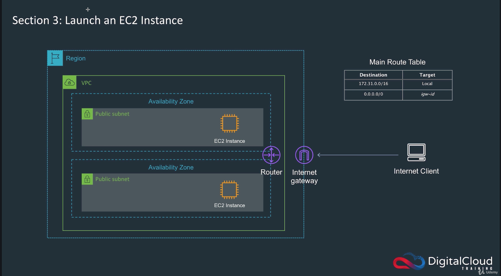
* 위 사진에 나와있는 대로 2개의 EC2 인스턴스를 런칭할 것이다
* 한 개는 리눅스, 다른 한 개는 윈도우즈 운영체제의 인스턴스를 런칭한다
* 전체적인 아키텍쳐는 다음과 같다
  - 하나의 리전 안에서 구현
  - default VPC를 사용한다
  - default VPC는 자동적으로 여러 개의 public subnet을 가지고 있다 
  - 2개의 Availability Zone에 있는 public subnet을 사용해 그 안에 EC2 인스턴스를 런칭한다
  - public subnet이 private subnet과 다른 점은 internet gateway에 연결된다는 것이다
  - VPC안에 설치된 EC2 인스턴스가 인터넷과 연결되려면 다음과 같은 요소들이 필요하다
  - 각각의 EC2 인스턴스는 public IP address를 가지고 있어야 한다
  - 서브넷은 항상 public IP address를 인스턴스에 자동적으로 할당한다(management console을 통해 변경할 수 있다)
  - VPC에 할당된 인터넷 게이트웨이가 필요하다
  - 서브넷에 할당된 라우트 테이블이 필요하다. 라우트 테이블은 인터넷 게이트웨이를 가리키고 있어야 한다

아마존 리눅스 인스턴스 런칭하기
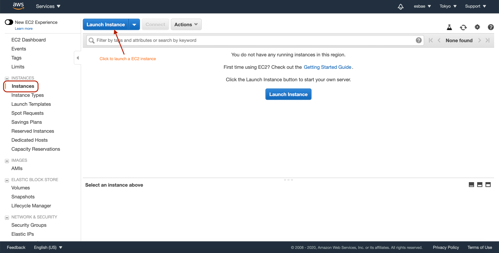
* EC2 서비스로 들어가서 instance 목록을 확인할 수 있는 탭을 누른다
* 그리고 Launch Instance 버튼을 클릭한다

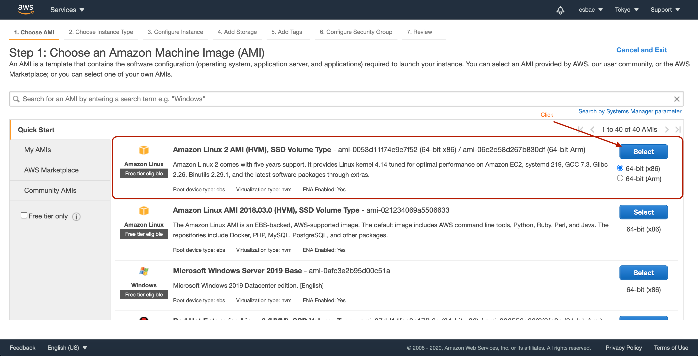
* 우분투, 센토스, 레드햇 등 여러 리눅스 인스턴스 타입이 있으므로 필요하다면 해당 이미지를 선택하면 된다
* 앞서 Overview에서 봤듯이 마켓플레이스나 개인 이미지를 사용해도 된다
* 여기서는 가장 많이 사용하는 Amazon Linux2 이미지를 사용한다

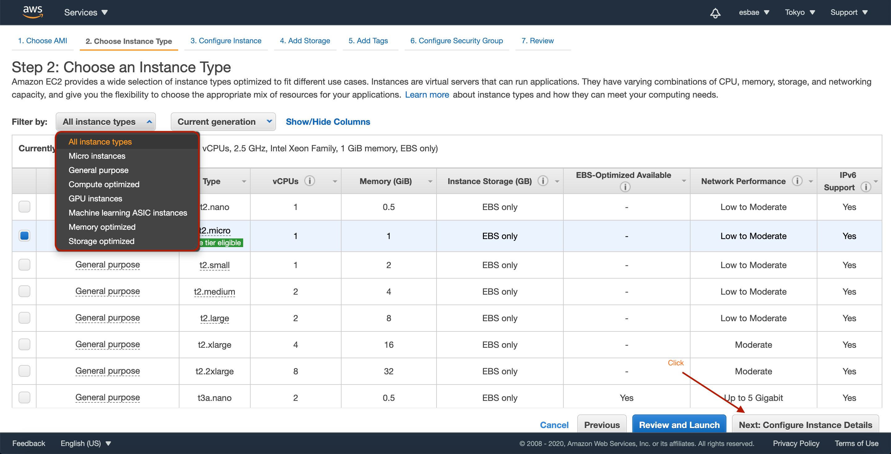
* 사용용도에 맞는 인스턴스 타입을 선택할 수 있다
* 여기서는 테스트 용도이므로 가장 저렴한(프리티어 적용도 가능) t2.micro인스턴스를 선택하고 다음 설정으로 넘어간다

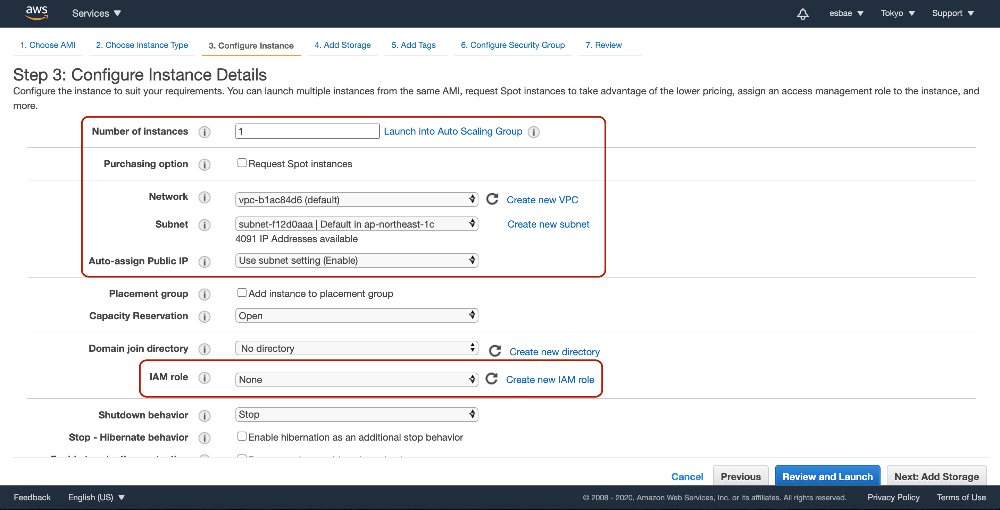
* 생성할 인스턴스 수를 지정할 수 있다
* 스팟 인스턴스로 생성할 것인지 선택할 수 있다
* 네트워크에는 default VPC를 선택한다
* 서브넷은 default VPC 안에 있는 것들 중에서 하나를 선택해준다
* Auto-assign Public IP는 자동으로 인스턴스에 public ip를 할당할 것인지 여부를 묻는 것으로 서브넷 세팅을 사용한다
* 중요한 설정 중 하나로 권한을 제한하는 IAM role이 있는데 이는 차후에 설명한다
* Next 버튼을 눌러 다음 설정화면으로 넘어가자

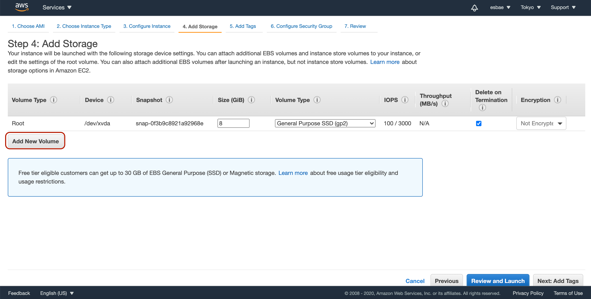
* 기본 루트 볼륨이 있고, Add New Volume버튼을 클릭하면 추가적인 EBS Volume을 추가할 수 있다
* 용량과 스토리지의 타입, 타입에 따른 초당 입출력, 대역폭, 암호화 여부 등의 정보를 수정하거나 확인할 수 있다
* 중요한 설정으로 Delete on Termination이 있는데, EC2 인스턴스가 삭제됐을 때 해당 스토리지도 자동으로 삭제할 것인지를 묻는 옵션이다
* 전부 기본 옵션인채로 Next버튼을 누른다

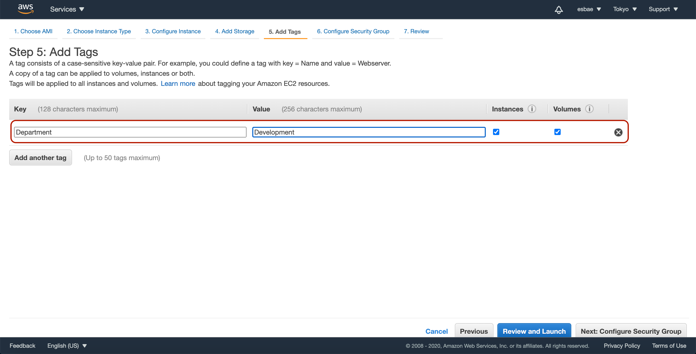
* 태그는 키-밸류 페어로 인스턴스에 대한 메타데이터를 저장할 때 사용한다
* 예를 들어 부서(Department)-개발(Development)와 같은 부가적인 정보를 인스턴스에 내부에 저장해 둘 수 있다
* Next버튼을 누른다

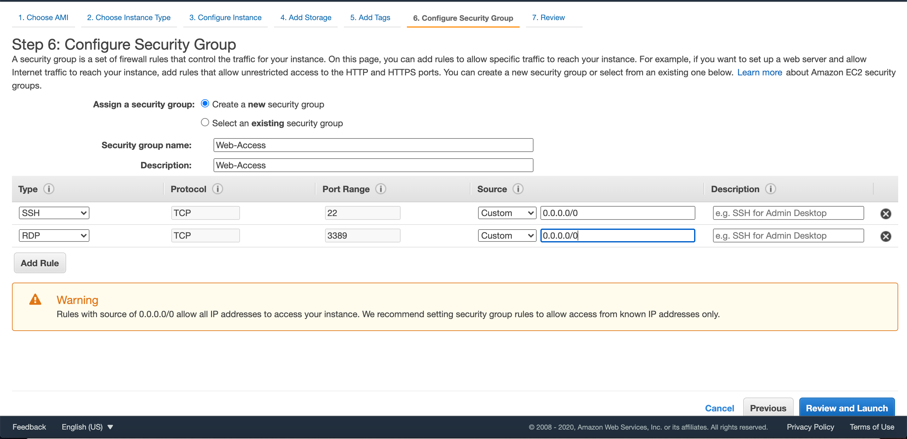
* 보안 그룹을 통해 트래픽에 대한 방화벽을 설정할 수 있다
* 새로운 보안 그룹을 생성하는 라디오 버튼을 클릭하고 보안 그룹명과 설명란을 Web-Access로 입력한다
* Linux인스턴스와 관련된 SSH와 Windows인스턴스와 관련된 RDP타입의 룰을 설정한다
* 같은 IP range를 설정해주고 Review and Launch버튼을 누른다

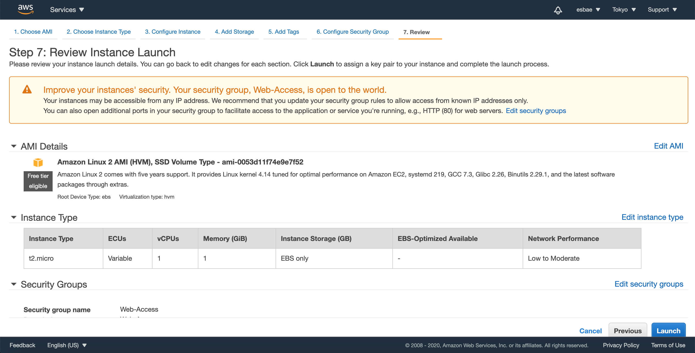
* 지금까지 설정해왔던 인스턴스의 정보일람을 확인할 수 있다
* Launch버튼을 눌러 인스턴스를 생성하자
* 그러면 다음 사진과 같이 Linux AMI에 접근하기 위한 키페어를 설정하는 모달이 나올 것이다
  - 윈도우 AMI에도 사용된다

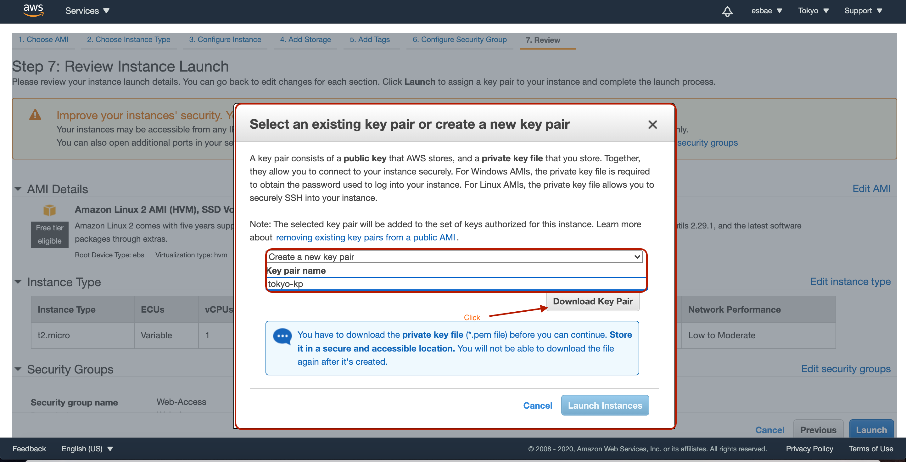
* 키페어는 퍼블릭 키와 프라이빗 키로 나뉘어 있다
  - AWS는 퍼블릭 키를 저장하고 인스턴스 보유자는 프라이빗 키 파일을 저장한다
* 새로운 키페어를 생성하는 옵션을 선택하고 키페어명을 입력한 후 Download Key Pair버튼을 눌러 키페어 파일을 저장한다
* 키페어 파일을 받은 후 Launch Instance 버튼을 눌러 인스턴스 생성을 완료한다

윈도우즈 인스턴스 생성하기
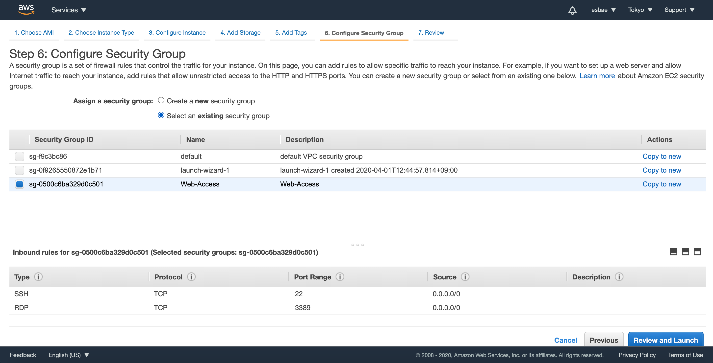
* 앞서 리눅스 인스턴스를 생성할 때 만들었던 시큐리티 그룹을 적용해주는 것과 앞서 리눅스 인스턴스에 적용했던 서브넷과 다른 서브넷을 설정해주는 것 이외에는 같은 설정으로 지정해준다
* 태그는 생성하지 않아도 된다

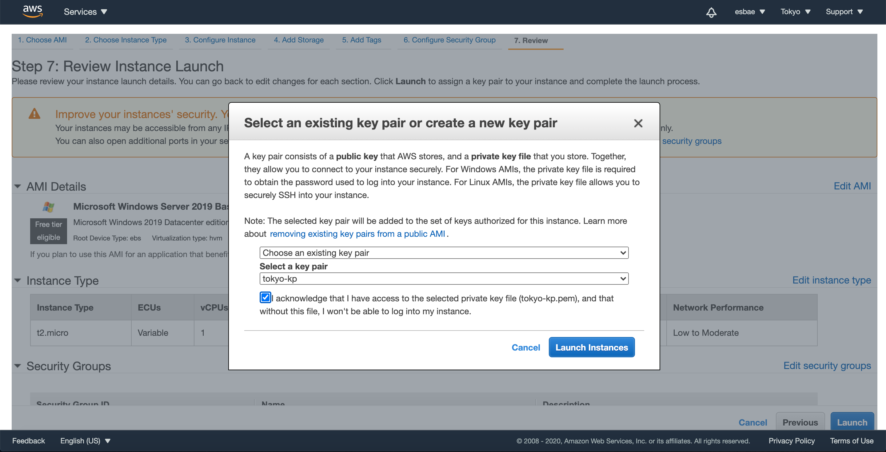
* 키페어도 앞서 리눅스 인스턴스를 생성할 때 만들었던 키페어로 지정해 런칭한다