## Elastic Compute Cloud Overview

EC2란
* 리눅스나 윈도우즈 같은 컴퓨터 자원을 런칭할 수 있는 서비스
* 온프레미스 환경에서의 가상머신(VMWare, VirtualBox, Hyper-V)과 같다고 생각하면 된다
* 각각의 EC2 인스턴스는 운영체제를 가지고 있다
* 또, 약간의 저장소와 가상 하드웨어 장치도 보유하고 있다
  - CPU, RAM, Network장비

AWS사이트에서 EC2 런치화면을 보면서 알아보기
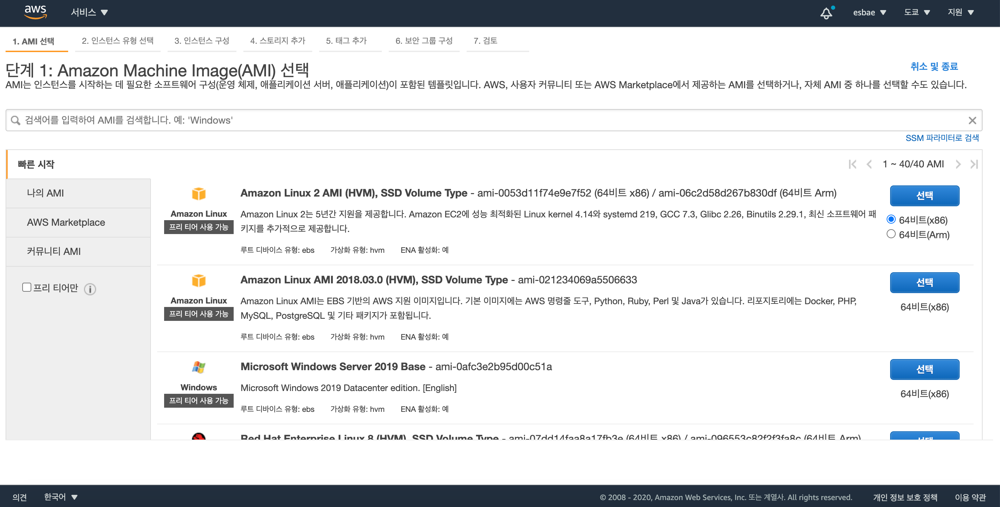
* 런치 버튼을 누르면 위 사진과 같이 운영체제를 선택할 수 있는 화면이 나온다
* 각각의 운영체제란 하나의 이미지(AMI)로 특정한 설정을 포함하고 있는 템플릿이다
* 처음 화면에 보이는 이미지들은 자주 사용되는 대표적인 이미지들이다
* 이 외에도 옆에 있는 탭에 보이듯이 개인 이미지나 마켓플레이스, 다른 커뮤니티의 이미지를 사용해서 인스턴스를 런칭할 수도 있다

마켓플레이스
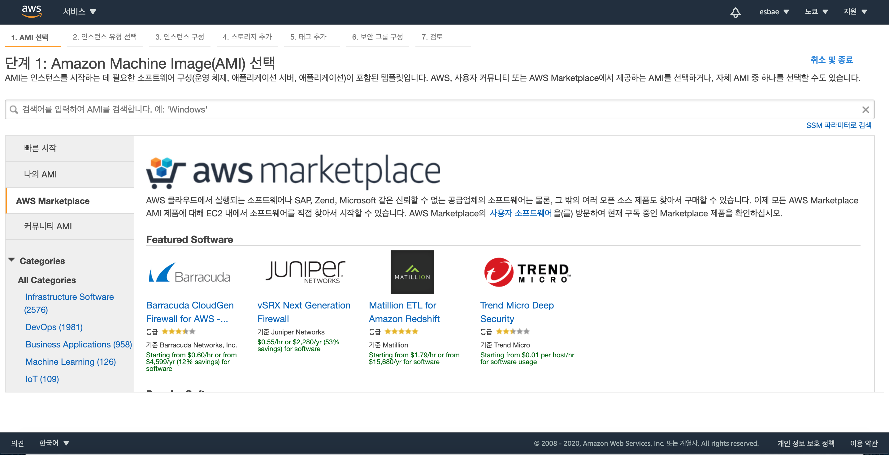
* 방화벽이나 로드밸런스 등의 다양한 서드파티 서비스들을 런칭할 수 있다
* 물론 비용이 비싼 것은 감안해야 한다

인스턴스 유형
* 위에서 봤던 맨 첫화면에서 첫번째에 있는 Amazon Linux이미지를 선택해 다음 화면으로 넘어가보자
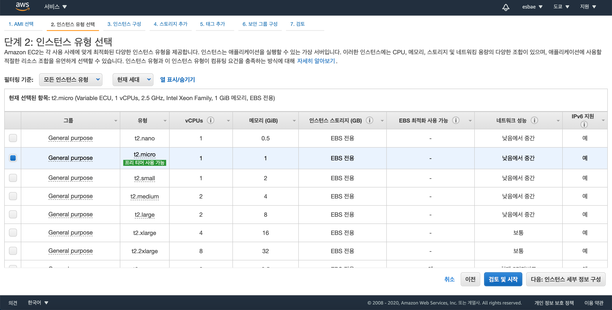
* 작업의 유형에 따라 CPU, GPU, RAM, Network, Storage 중 특정 작업에 최적화된 인스턴스를 선택할 수 있다
 
아직은 Overview이므로 인스턴스 런칭을 더 진행하지 않고 여러 정보를 찾아보자
* 새 인스턴스 런치 버튼을 누르기 전, EC2 서비스 첫 화면으로 이동한다
* 옆의 네비게이터에서 limits를 누르면 기본적으로 설정되어 있는 EC2 인스턴스 런칭에 대한 제약사항들을 확인할 수 있다
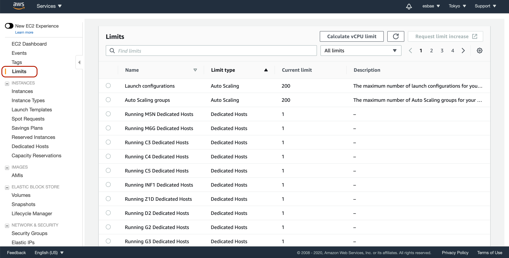
* 이 설정들은 AWS와 상담을 통해 해제할 수 있다

사용 가능한 인스턴스 타입 목록 확인
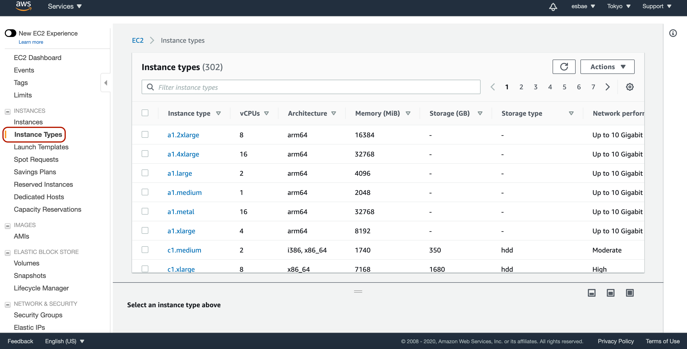

실행중인 인스턴스 목록
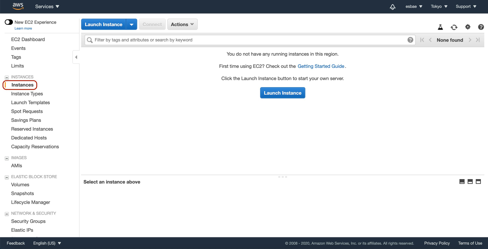
* instances 탭을 누르면 현재 특정 리전에서 실행중인 ec2 인스턴스 목록을 보여준다
* 위 화면에 있는 Launch Instance버튼을 누르면 온디맨드 인스턴스를 런칭할 수 있다
* 온디맨드 인스턴스는 가격 할인은 없는 대신 자유도가 높은 인스턴스로 언제든지 필요가 없어지면 중단시킬 수 있다
* 온디맨드 인스턴스 외에 AWS는 EC2를 할인받은 가격으로 런칭할 수 있는 옵션들을 제공하고 있다

Reserved Instance예약 인스턴스
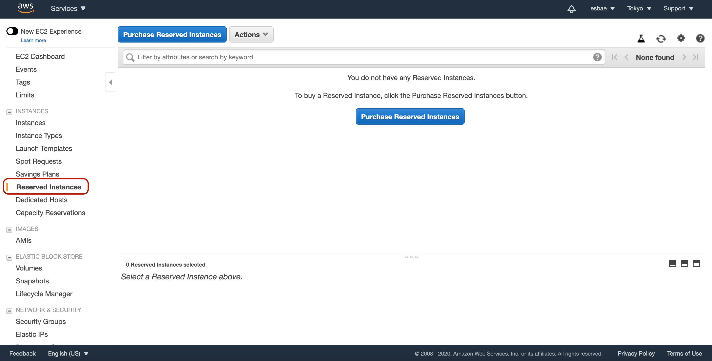
* Purchase Reserved Instance버튼을 눌러 예약 인스턴스를 생성할 수 있다
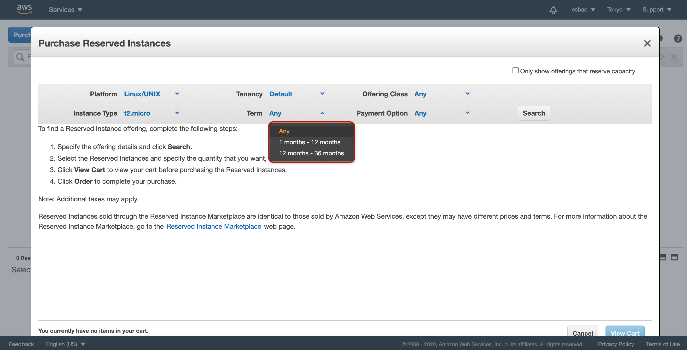
* 기간은 1년 혹은 3년을 선택할 수 있다
* 정해진 기간동안 인스턴스를 사용하는 대신 할인을 받을 수 있는 제도다
* 앞서 보았던 온디맨드 인스턴스에 비하면 75%정도의 할인을 받을 수 있다
* 반대로 필요하지 않더라도 계속 사용할 수 밖에 없는 단점이 있다

Spot Instance
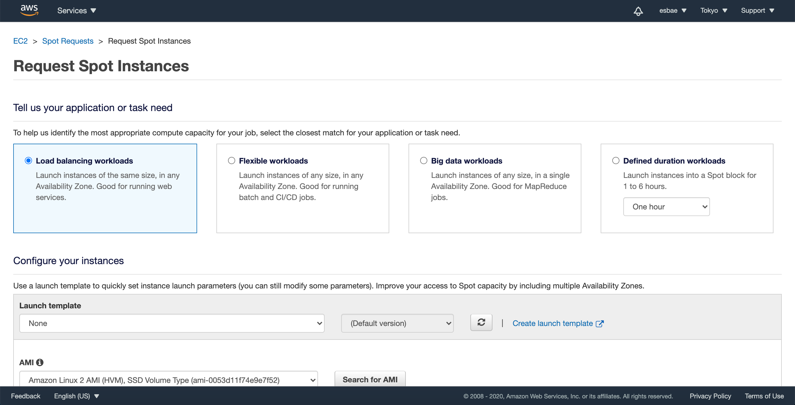
* 가장 많이 할인을 받을 수 있는 타입의 인스턴스다
* 그러나 누군가가 많은 사용량을 요구하면 AWS가 강제로 Spot Instance를 셧다운 시켜버릴 수도 있다
* 따라서 커다란 컴퓨팅 작업이라 온디맨드로 하기에는 비싸고 배치작업 같이 지속적이지 않은 작업이 필요한 경우에 사용하는 것이 좋다

Savings Plans
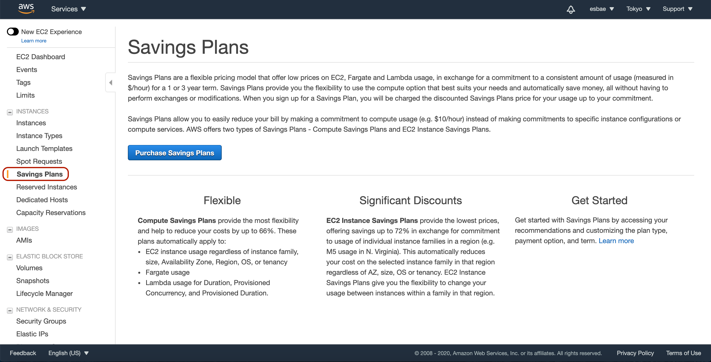
* 최근에 생긴 옵션으로 기본적으로 예약 인스턴스와 비슷하다
* Fargate와 같은 컨테이너 기반 서비스를 이용할 수 있는 점이 다르다

Dedicated Hosts
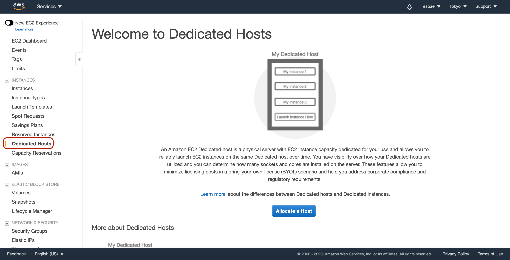
* 앞서 봤던 옵션들과는 다른 성격의 옵션으로, 다른 인스턴스들은 하드웨어 안의 자원을 공유하는 반면 이 옵션을 사용하면 물리적인 서버를 독점적으로 사용할 수 있다
* 라이선스 비용을 줄일 수 있는 옵션이기도 하다

Scheduled Instance

* 주기적으로 특정 작업을 수행할 수 있도록 해주는 인스턴스다
* 화면에 써져 있듯이 매일, 주간, 월간 예약이 가능하다
* 사용할 수 있는 리전과 그렇지 않은 리전이 있으니 주의하자
  - 2020.09.21 현재 가능한 리전은 다음과 같다
  - US East (N. Virginia)
  - EU (Ireland)
  - US West (Oregon)

Elastic Block Store(EBS)
* EC2 인스턴스 안에 포함시킬 수 있는 저장장치다
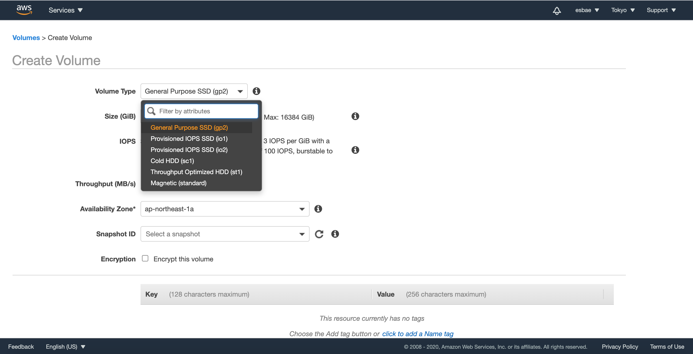
* 사용목적에 따라 볼륨타입을 선택할 수 있다