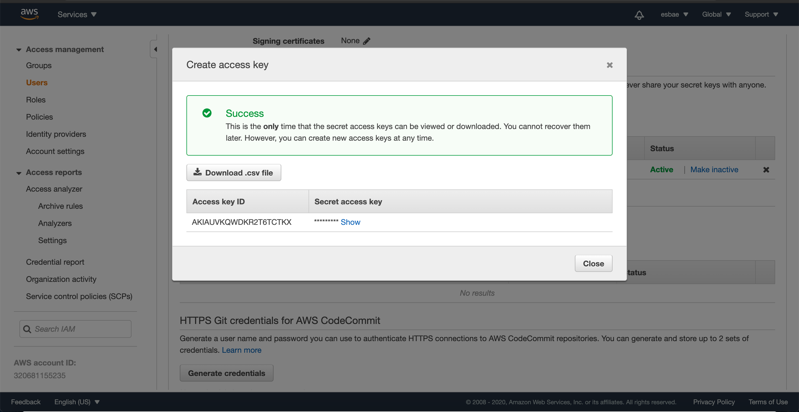
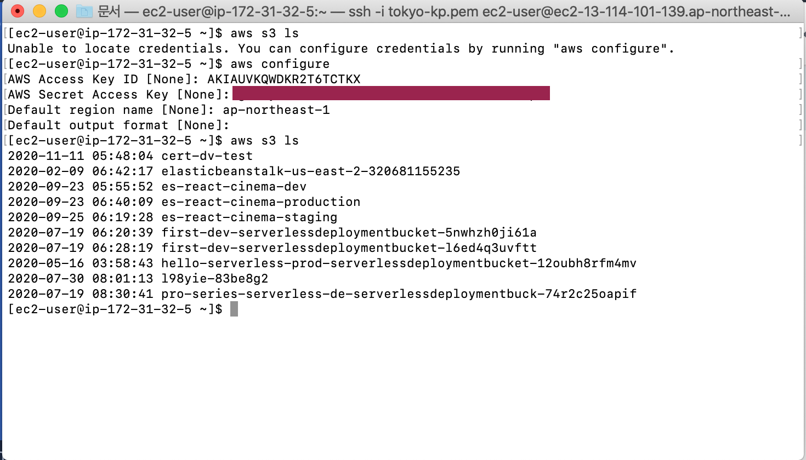

# Amazon S3 and IAM Role Overview

Amazon S3
* S3란 Simple Storage Service의 약자로 오브젝트 기반의 저장소 시스템이다
* S3의 버킷에 오브젝트(파일)를 업로드할 수 있으며 URL을 통해 버킷에 있는 파일에 접근이 가능하다
* EC2인스턴스를 통해 S3에 업로드되어 있는 파일을 가져오는 서비스를 만들어 볼 것이다

IAM Role
* Identity and Access management의 약자로 유저, 그룹, 역할(Role), 정책(Policie)들을 생성하는 서비스다
* IAM Role에는 특정 서비스에 대한 권한인 정책(Policie)들을 할당할 수 있다
* IAM Role을 통해 EC2인스턴스가 직접 액세스 키와 시크릿 키를 가지지 않고도 S3에 접근해 원하는 작업을 할 수 있게 된다 

S3 버킷 생성하기

* 위 사진에서 보이듯이 S3에서는 특정 리전을 선택할 수 없다
* S3의 버킷 네임은 글로벌 네임스페이스를 가지기 때문이다

* 따라서 모든 아마존 S3의 버킷 네임과 다른 유니크한 값을 설정해야 한다
* 그러나 버킷이 저장되는 공간은 두 번째 선택란에 보이듯이 특정 리전이다

EC2인스턴스 생성하기
* EC2인스턴스를 생성해 앞서 만든 S3 버킷에 접근해볼 것이다
* EC2의 모든 옵션은 기본 옵션으로 하되 시큐리티 그룹만 기존에 만들었던 Web-Access를 지정해준다
  - SSH로 접근가능한 22포트를 사용하기 위함이다
* 지금부터 실습은 터미널로 EC2인스턴스에 연결되어 있음을 가정하고 설명한다

* 우선 aws s3 ls라는 커맨드로 현재 계정에서 접근 가능한 버킷리스트를 가져온다
* 그러나 보이듯이 현재로서는 접근할 수 있는 권한이 없다

* aws configure커맨드로 액세스 키 아이디와 시크릿 키를 입력해 접근할 수 있다

키 생성하기

* IAM에서 Users탭에 특정 유저를 선택한 후 Security Credential이라는 탭을 클릭하면 위와 같은 화면이 나온다
* Create access key라는 버튼을 눌러 키 페어를 얻는다

* 생성한 키 페어를 터미널에 입력하자

* 키 페어 아래에 버킷목록을 검색할 리전을 입력한 후 
* 다시 aws s3 ls 커맨드를 입력해보면 해당 리전에 있는 버킷 리스트들이 출력됨을 확인할 수 있다
* 이처럼 키페어를 이용해 접속하는 방법도 가능하지만 이는 크리덴셜이 기기에 설치되어야 하므로 보안적으로 바람직하지 않다

* 위 사진에서 보이듯이 앞서 입력한 키 페어 정보가 EC2에 저장되어 있다

* 따라서 안전하게 사용하려면 매번 사용 후에 위와 같이 크리덴셜을 삭제해 주어야 한다
* 이처럼 매번 생성과 삭제를 반복하는 것은 매우 불편하다

IAM Role 이용하기
* 위와 같이 번거로운 작업을 반복하지 않기 위해 IAM Role을 활용할 수 있다

* IAM에서 Roles탭을 클릭한 뒤 Create role버튼을 클릭한다

* EC2를 선택한 뒤 Next: Permissions버튼을 클릭한다

* 검색창에 S3를 검색해 S3에 접근할 수 있는 모든 권한을 가진 AmazonS3FullAccess권한을 선택하고 Next버튼을 누른다
* 다음 화면은 태그 화면인데 태그는 설정하지 않고 Next버튼을 누른다

* 역할의 이름을 적절히 설정한 후 Create role버튼을 눌러 생성을 완료한다

* 생성한 IAM Role을 EC2 인스턴스에 적용하기 위해
* EC2 인스턴스를 선택한 후 Actions -> Instance Settings -> Attach/Replace IAM Role을 클릭한다

* 앞서 설정한 IAM Role을 지정해주고 Apply버튼을 눌러 적용을 완료한다

* 다시 aws s3 ls 커맨드를 실행해보면 버킷 리스트를 가져오는 것을 확인할 수 있다