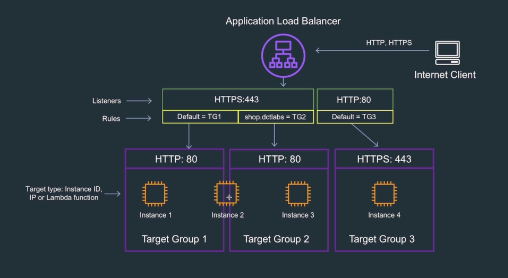
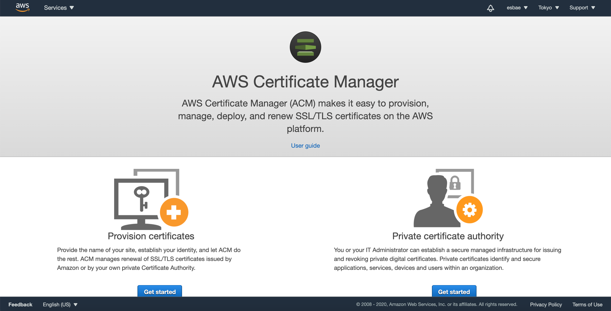
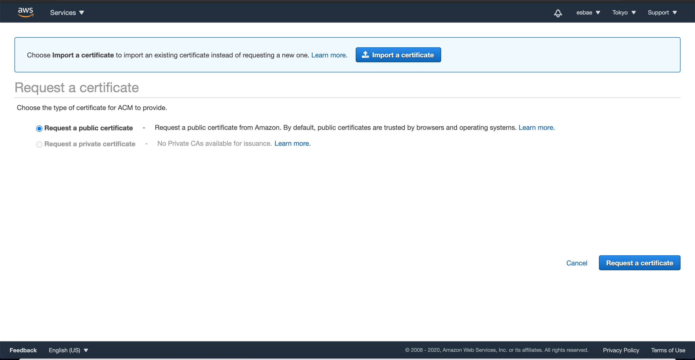

# ALB listeners and SSL TLS

리스너 활용하기

* 위 그림과 같이 유저가 애플리케이션으로 요청을 보낼 때, HTTPS프로토콜로 보내는 경우와 HTTP프로토콜로 보내는 경우가 있다
* HTTP로 요청을 보내는 경우 타겟 그룹에 SSL을 적용할 필요가 있다

* 먼저 서티피케이셔 매니저를 통해 SSL이 적용가능하도록 해놓아야 한다
* get started버튼을 누른다

* Request a public certificate가 체크된 상태로 Request a certificate버튼을 누른다