# Application Load Balancer - Host-Based Routing

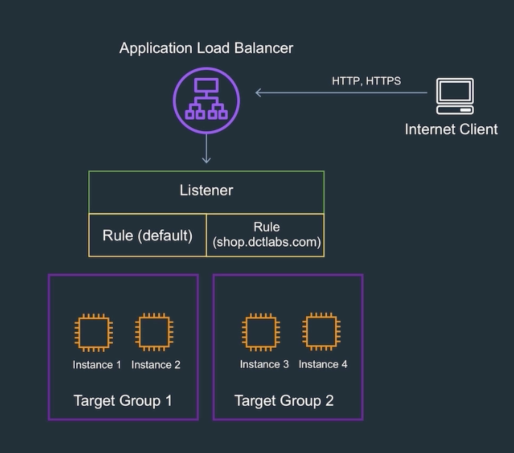
* 호스트 기반 라우팅은 기본 domain과 다른 서브 도메인으로 접속시 다른 타겟 그룹에서 처리하도록 하는 방법이다
* 이를 위해 우선 Route53에서 도메인 레코드 설정이 필요하다

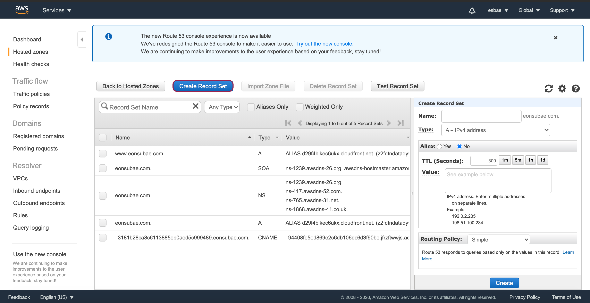
* Route 53로 이동해 Hosted Zone을 누른 뒤 등록된 도메인을 클릭한다
* Create Record Set을 클릭한다

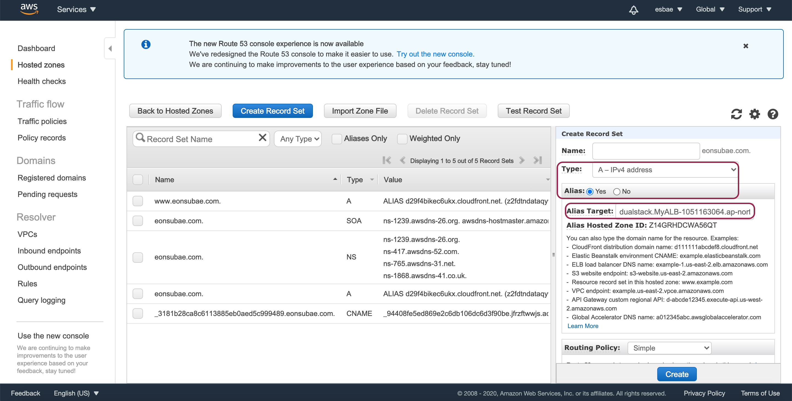
* Alias를 Yes로 설정하고 Alias Target에 로드밸런서를 지정한다
* Create버튼을 누르면 default경로에 대한 Record Set이 추가될 것이다
  - 내 경우에는 이미 운용중인 사이트와 연동되어 있어 생성되지 않는다

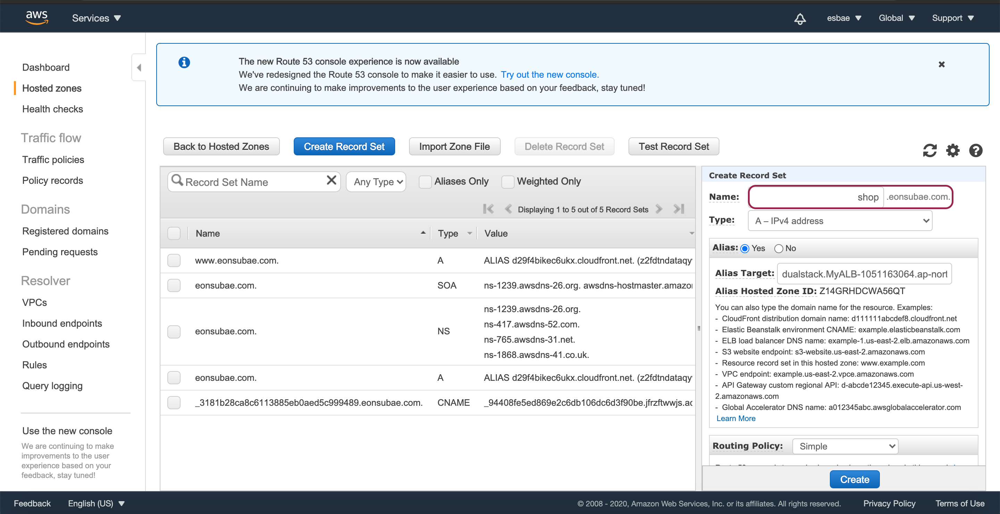
* 그 다음 다시 Create Record Set을 클릭한 뒤 
* Name에 shop을 추가하고 마찬가지로 Alias를 Yes로 설정하고 Alias Target에 로드밸런서를 지정한다
* Create버튼을 눌러 추가를 완료한다

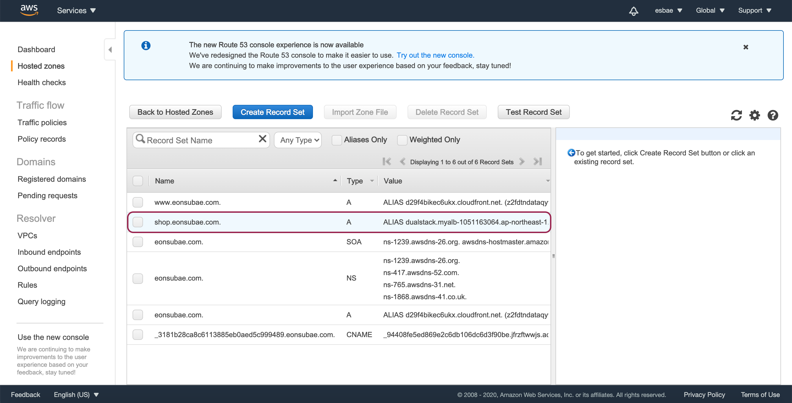
* shop 서브도메인에 대한 레코드 셋이 등록된 것을 확인할 수 있다

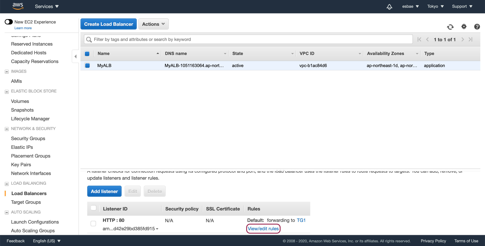
* 다시 로드밸런서 탭으로 이동해 로드밸런서를 선택하고
* 화면 아래의 Listeners 탭에서 View/edit rules를 클릭한다

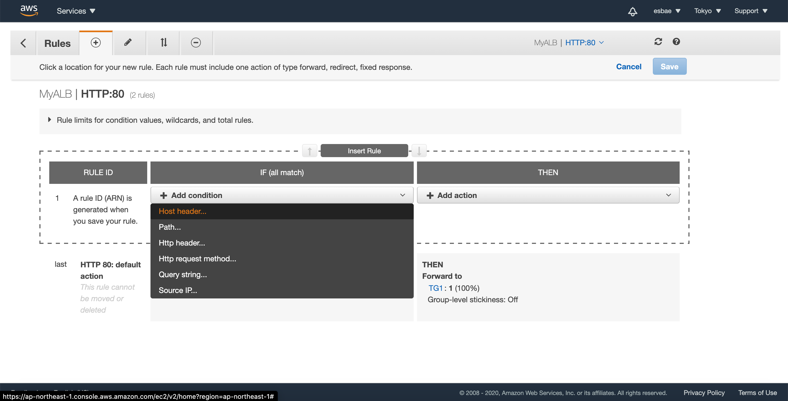
* Insert Rule을 클릭한 뒤 Add Condition을 클릭하고 Host header를 클릭한다

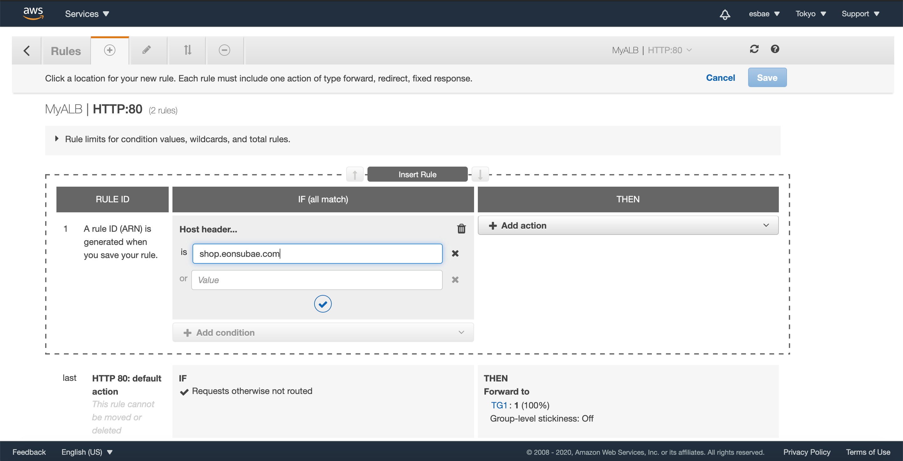
* 그 다음 앞서 생성한 shop 레코드 셋을 등록해준다

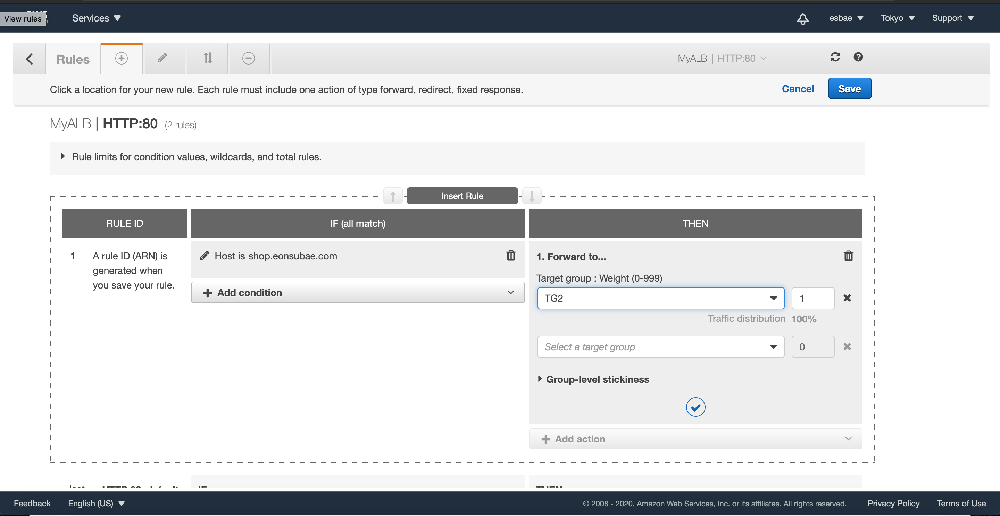
* 옆에 있는 THEN 탭에 Add action을 클릭한 뒤 Forward to를 클릭한다
* 그 다음 두 번째 타겟 그룹을 선택하고 체크 버튼을 눌러 등록을 완료한다
* Save버튼을 눌러 설정을 저장해준다

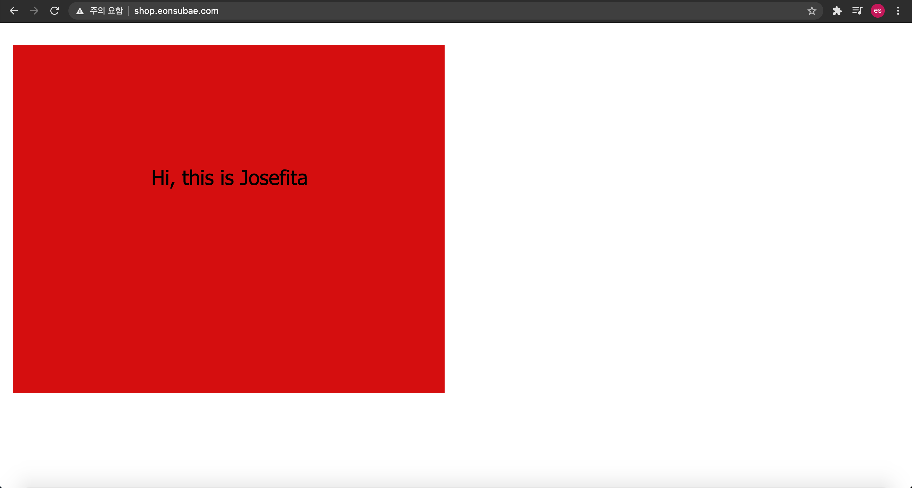

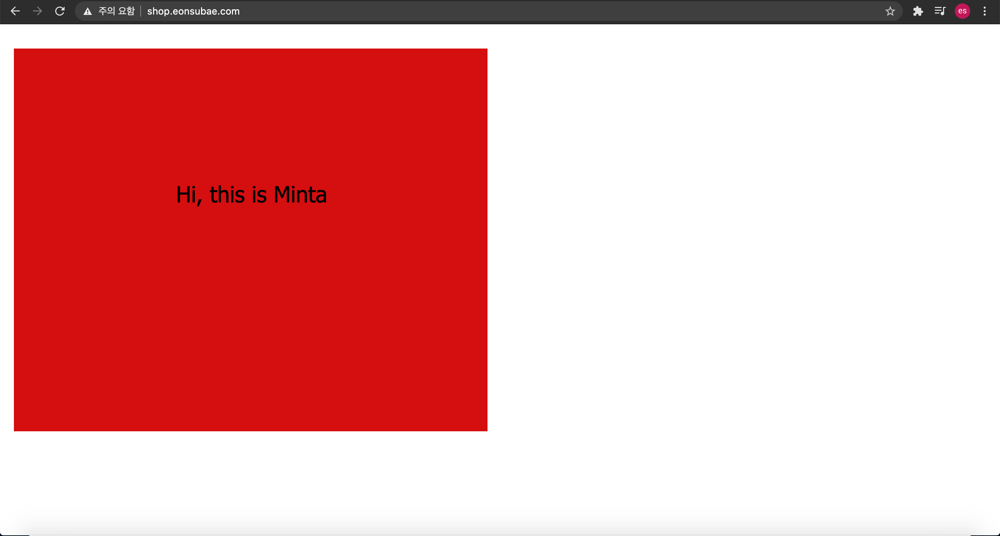
* shop 서브도메인으로 접속해 새로고침을 해보면 요청마다 이름이 바뀌는 것을 확인할 수 있을 것이다

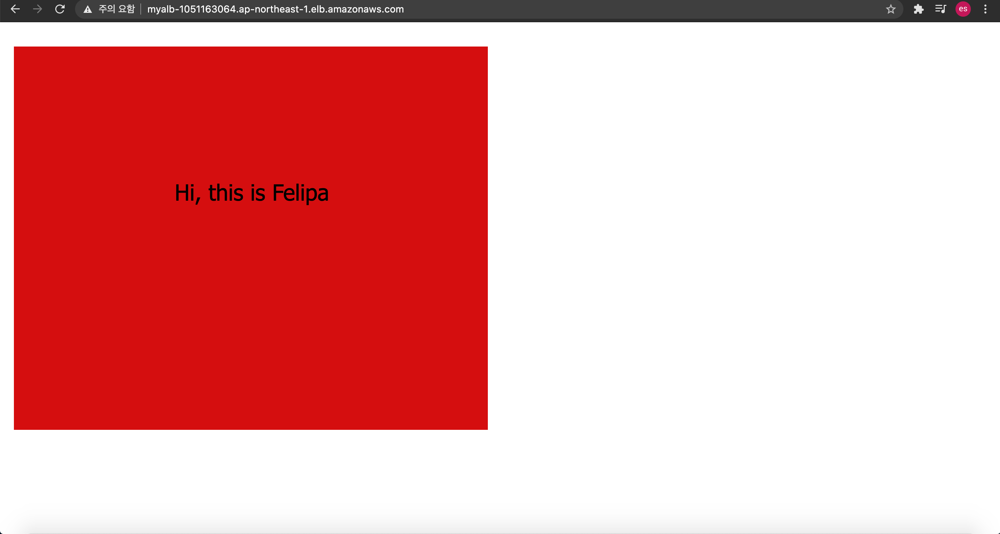

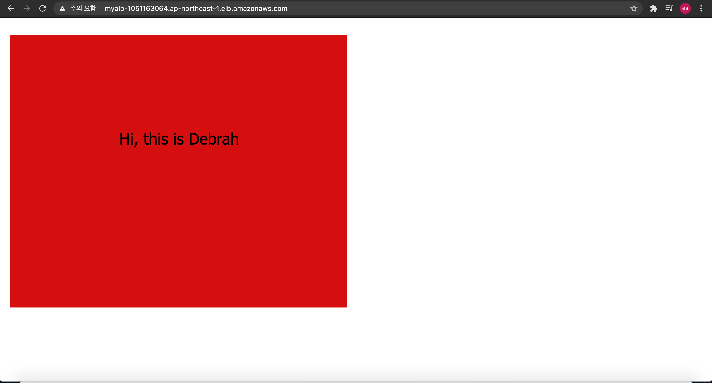
* 디폴트 도메인으로 접속해 새로고침을 해봐도 요청마다 이름이 바뀌는 것을 확인할 수 있을 것이다

실습이 끝난 후의 처리
* 로드밸런서를 삭제한다
* 2개의 타겟 그룹을 삭제한다
* 4개의 EC2 인스턴스를 삭제한다
* shop 레코드셋을 삭제한다