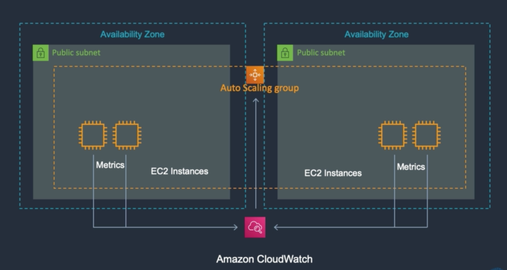

# EC2 Auto Scaling Overview

오토 스케일링
* 자동적으로 인스턴스를 런칭해주는 서비스
* 원하는 인스턴스 갯수를 지정하면 항상 그 숫자만큼의 인스턴스를 유지시켜준다
* 오토 스케일링은 항상 수평적으로 작동한다
* 만약 특정 인스턴스의 헬스체크가 실패하면 해당 인스턴스를 대체할 새로운 인스턴스를 생성해준다
* 로드밸런서 등의 헬스체크 외에도 매트릭스를 사용할 수 있다
* 매트릭스(metrics)는 클라우드와치에 CPU의 사용량, 커넥션의 갯수, 디스크 용량 등의 상태를 보고한다
* 예를 들어, 매트릭스의 리포트 결과 인스턴스들의 CPU 사용량이 80%를 초과하면 클라우드워치에 보고하도록 설정할 수 있다
* 그러면 클라우드워치는 오토 스케일링 그룹에 이를 알리고 오토 스케일링 그룹은 새로운 인스턴스를 생성하는 방식이다
* 반대로 인스턴스들의 CPU 사용량이 60%미만이면 추가된 인스턴스를 삭제하도록 만들 수도 있다

로드밸런서와 오토 스케일링을 함께 사용하기
* 로드밸런서를 오토 스케일링과 함께 사용하면 보다 장애발생에 탄력적으로 대응할 수 있다
* 로드밸런서가 오토 스케일링 그룹에 있는 인스턴스들에 커넥션들을 분배한다
* 오토 스케일링 그룹은 설정된 파라미터(ex. CPU 사용량 80%이상)에 의해 탄력적으로 인스턴스 갯수를 늘리거나 줄인다