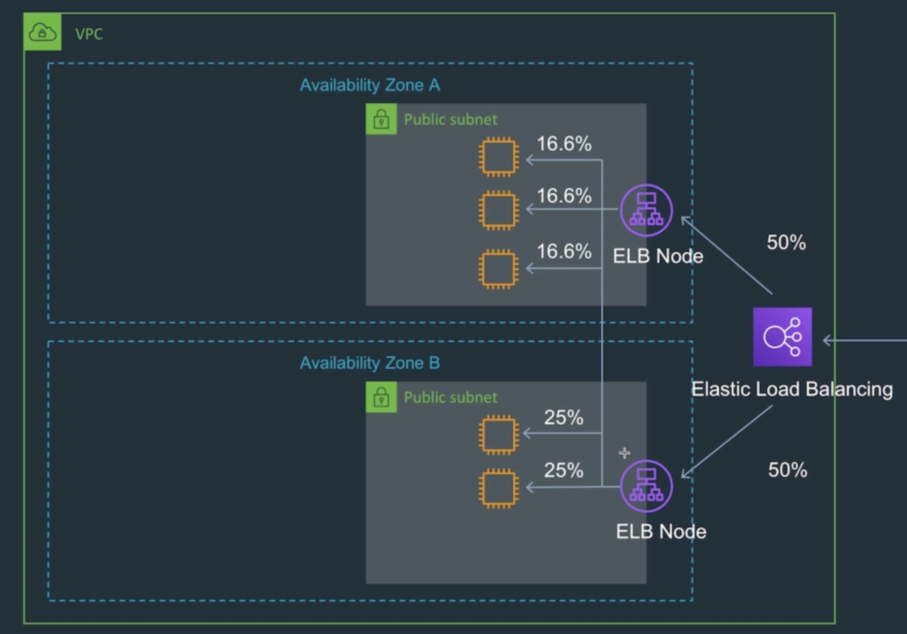
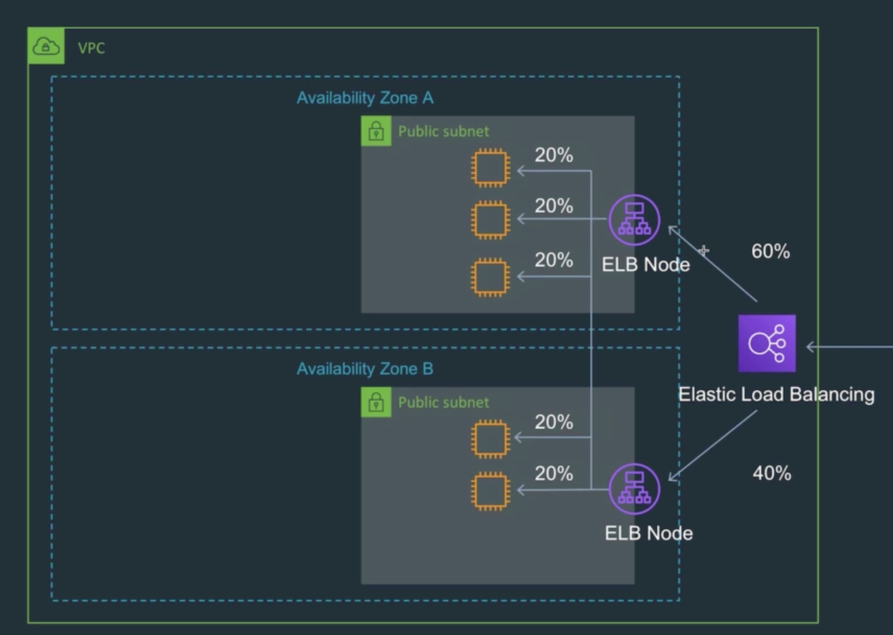
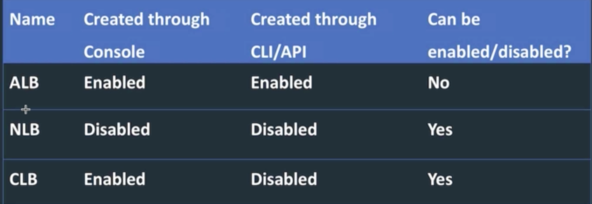
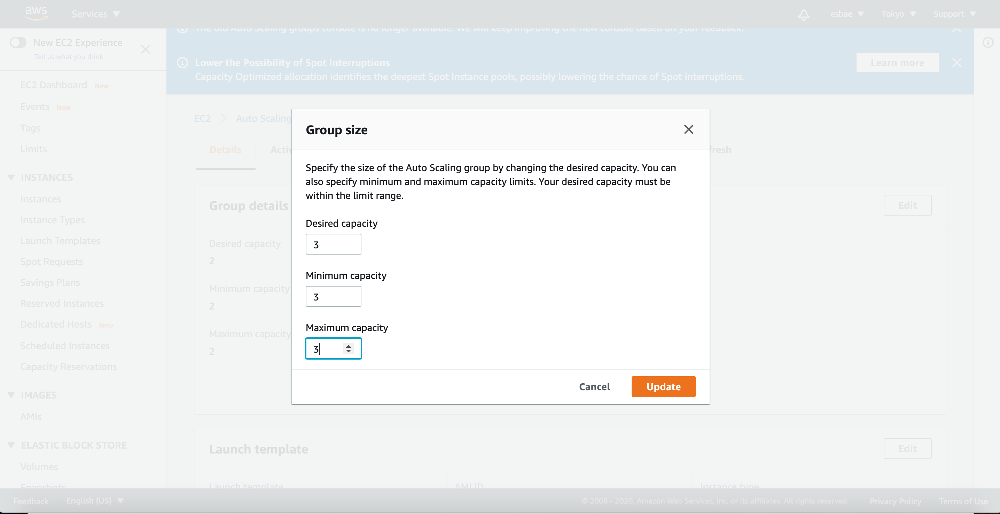

# Cross-Zone Load Balancing Overview and Setting up the Lab

크로스 존 로드 밸런싱
* 복수의 AZ에 서로 다른 갯수의 인스턴스를 런칭했음을 가정해보자

* 위 사진처럼 첫 번째 AZ는 3개의 인스턴스를, 두 번째 인스턴스는 2개의 인스턴스를 가지고 있다
* 그런데 로드밸런서는 AZ마다의 인스턴스 갯수를 생각하지 않고 각각 50%씩 라운드로빈을 하고 있다
* 따라서 같은 템플릿으로 생성한 EC2 인스턴스 이지만 첫 번째 AZ에 있는 인스턴스는 16.6%의 트래픽을 처리하고
* 두 번째 AZ에 있는 인스턴스는 25%의 트래픽을 처리하고 있다

* 위처럼 고르게 라운드로빈을 적용하기 위해서는 크로스 존 로드 밸런싱이 필요하다

* 위 표는 로드 밸런서별로 설정 가능한 옵션을 나타낸다

어플리케이션 로드밸런서를 이용한 실습준비

* 앞서 생성했던 오토 스케일링 그룹의 그룹 사이즈를 2에서 3으로 변경해준다