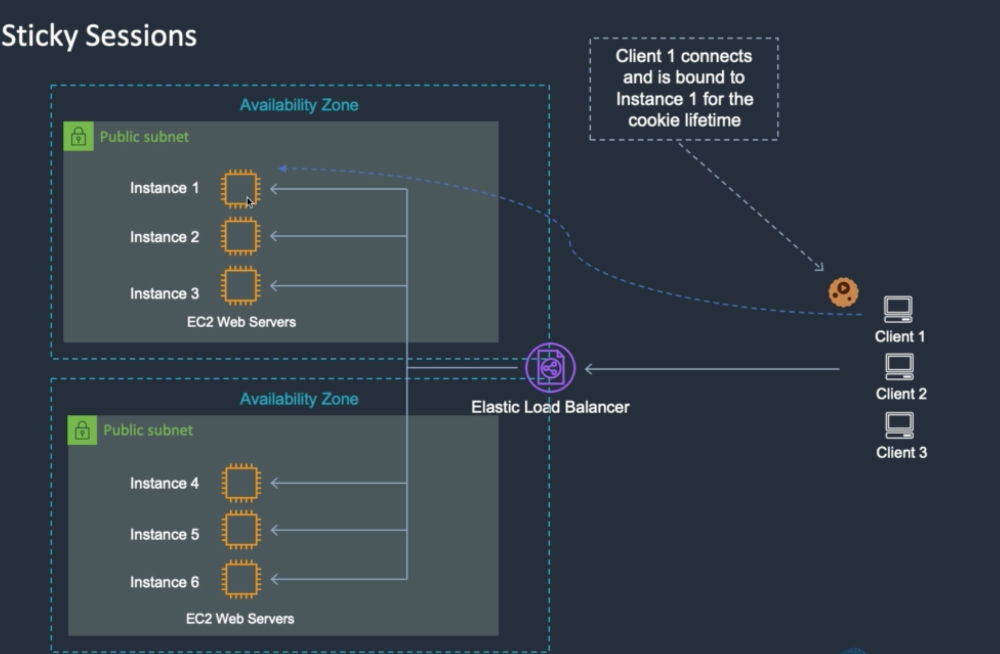
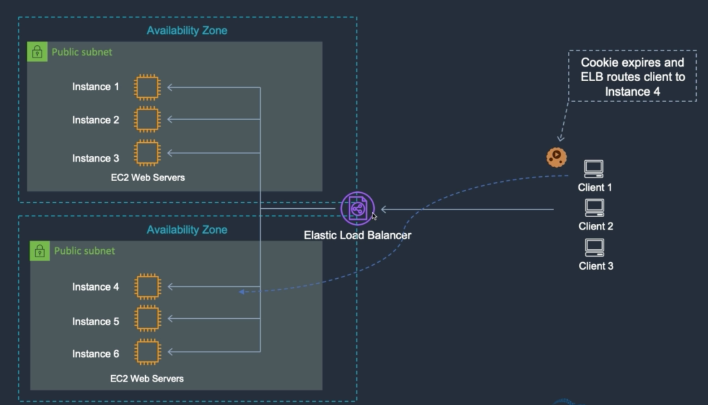
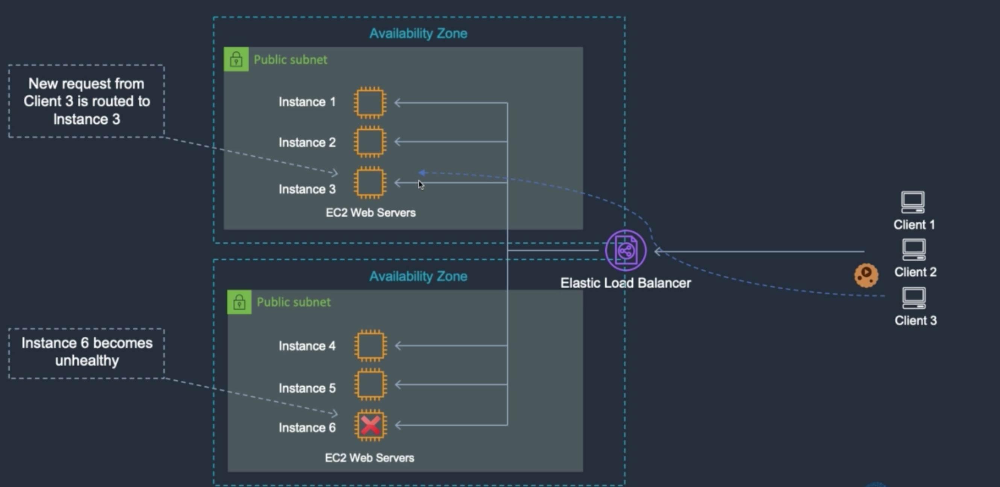
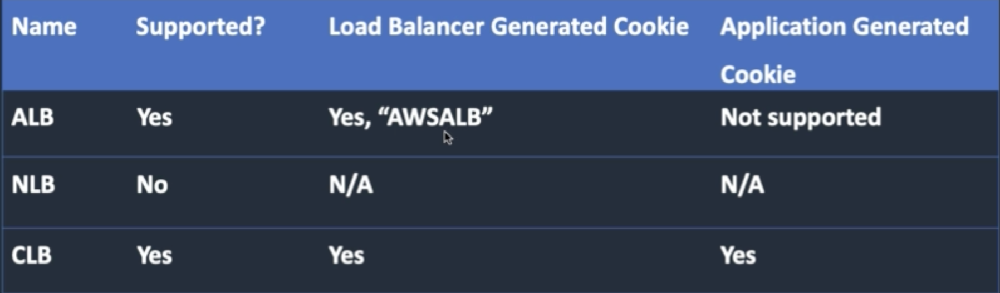

# ELB Sticky Sessions

스티키 세션
* 어플리케이션에서 세션을 사용하는 경우 한 유저의 요청이 매번 다른 인스턴스로 라운드 로빈이 되면 안된다
* 이 때 유저 정보를 기억하기 위해 로드밸런서가 쿠키를 발급해 관리한다

* 클라이언트 1은 특정 인스턴스에 접근할 수 있는 쿠키를 가진다

* 만일 쿠키가 만료되면 다른 인스턴스로 라우팅한다

* 만일 스티키 세션을 사용하던 중에 해당 인스턴스의 헬스체크가 실패하면 다른 인스턴스로 라우팅한다

* 위 표는 로드밸런서 별 스티키 세션 지원 여부 정보다
* ALB의 경우 어플리케이션이 생성한 쿠키는 사용할 수 없으며
* 로드밸런서가 생성한 쿠키만 사용할 수 있는데, 해당 쿠키의 이름은 항상 AWSALB여야 한다