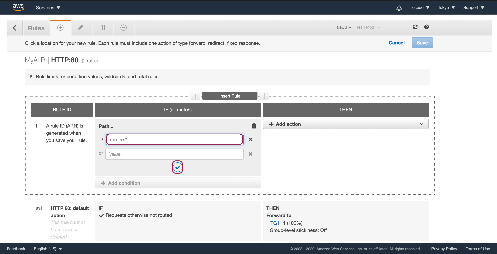

# Application Load Balancer - Path-Based Routing 

Path Based Routing


* 어플리케이션 로드 밸런서는 패스 기반 라우팅과 호스트 기반 라우팅이 있다
* 패스 기반 라우팅은 룰의 상태에 따라 다른 타겟 그룹으로 요청을 분산시킨다
* 예를 들어, 위 사진에서는 엔드포인트가 /인 경우 타겟 그룹1에 있는 타겟들에 요청을 보내고
* 엔드포인트가 /orders인 경우 타겟 그룹2에 있는 타겟들에 요청을 보낸다

4개의 EC2 인스턴스 생성하기
* 앞서 네트워크 로드밸런서의 실습 때와 같은 방식으로 생성해주면 된다
* 다만 4개의 인스턴스가 필요하므로 Configure Instance Details설정 화면에서 Number of instances를 4로 설정한다
* IAM Role을 앞서 만들었던 S3에 대한 모든 권한을 갖고 있는 S3-Full-Access로 설정한다
* 스크롤을 내려 User Data란에 이하의 내용을 입력한다
  - index.html을 orders.html로 복사하는 부분만 다르다

```txt
#!/bin/bash
yum update -y
yum install httpd -y
systemctl start httpd
systemctl enable httpd
cd /var/www/html
aws s3 cp s3://<My-Bucket-Name>/names.csv ./
aws s3 cp s3://<My-Bucket-Name>/index.txt ./
EC2NAME=`cat ./names.csv|sort -R|head -n 1|xargs`
sed "s/INSTANCE/$EC2NAME/" index.txt > index.html
cp index.html orders.html
```

* 시큐리티 그룹은 Web-Access로 지정한다


* 타겟그룹 설정을 위해 Target Groups탭으로 이동한다
* Create target group 버튼을 눌러 생성화면으로 이동하자

두 개의 타겟 그룹 생성하기


* 타겟 그룹의 이름을 입력한다


* 타겟 그룹에 2개의 인스턴스를 사용할 것이므로 Healthy threshold를 2로 설정하고 Create버튼을 눌러 생성을 완료해주자


* 타겟 그룹들에 인스턴스를 할당하기 전에 앞서 생성한 4개의 인스턴스에 구분하기 쉽도록 이름을 설정한다


* 다시 타겟 그룹으로 이동해 타겟 그룹을 선택한 뒤 아래의 Target 탭에서 Edit 버튼을 누른다


* 첫번째 타겟 그룹에는 instance1, 2를 두 번째 타겟 그룹에는 instance3, 4를 할당해준다
* 할당 방법은 할당할 인스턴스를 체크한 뒤 Add to registered를 클릭한 뒤 Save를 클릭하면 된다


* 이제 어플리케이션 로드 밸런서를 생성해주자
* Load Balancers탭에서 ALB의 Create버튼을 클릭한다


* ALB의 이름을 입력하고


* 서브넷을 전부 체크한 뒤 Next버튼을 누른다


* Web-Access 시큐리티 그룹을 설정한다


* 타겟 그룹에 앞서 생성했던 첫번째 타겟 그룹을 지정하고 Next버튼을 누른다


* 생성한 ALB를 선택한 뒤 아래의 Listeners탭을 누르고 설정된 listener의 Rules란에 있는 edit rules를 누른다


* +모양의 탭을 누른 후 insert Rule을 클릭한다


* IF란에 Path를 선택한다


* /orders*를 입력해 /orders로 시작하는 엔드포인트의 요청을 처리하도록 설정한다


* 그 다음 then 탭에서 Forward to를 선택한다


* TG2 타겟 그룹을 선택한 뒤 체크 버튼을 클릭해 등록을 완료한다
* 이제 /orders로 시작하는 엔드포인트의 요청은 TG2에 속해 있는 인스턴스들이 처리하게 된다
* Save버튼을 눌러 설정을 완료해주자


* 이제 기본적인 요청은 TG1이 /orders로 시작하는 엔드포인트의 요청은 TG2가 처리하도록 설정되어 있음을 확인할 수 있다


* 로드밸런서 목록으로 이동해 ALB를 선택하고 아래의 Description탭에서 DNS Name을 복사한다
* 브라우저로 접속해 새로고침을 하며 확인해보자


* 새로고침을 할 때마다 이름이 번갈아가며 뜨는 것을 확인할 수 있을 것이다
* 이는 TG1타겟 그룹에 있는 instance1, 2가 라운드로빈 되기 때문이다


* orders로 엔드포인트를 변경시키고 새로고침을 여러번 해보자
* 위와 같이 서로 다른 이름의 화면이 번갈아가며 뜰 것이다
* 이는 TG2타겟 그룹에 있는 instance3, 4가 라운드로빈 되기 때문이다

실습이 끝난 후의 처리
* 곧이어 Host Based Routing을 설정해볼 것이다
* 따라서 ALB를 제거하지 않고 추가한 패스 설정만 제거해주자
* 위에서 path를 설정했었던 것과 같이 edit rule화면으로 이동한다


* -모양의 탭을 누르고 path 설정을 체크한 뒤 Delete버튼을 눌러 삭제한다
* Delete버튼을 누르면 다음과 같은 화면이 뜰 것이다

