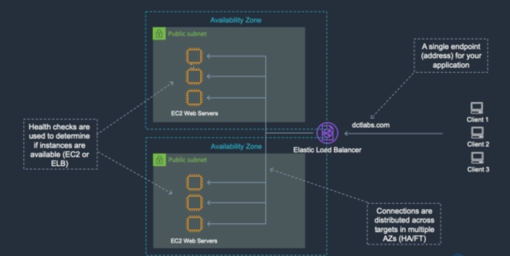
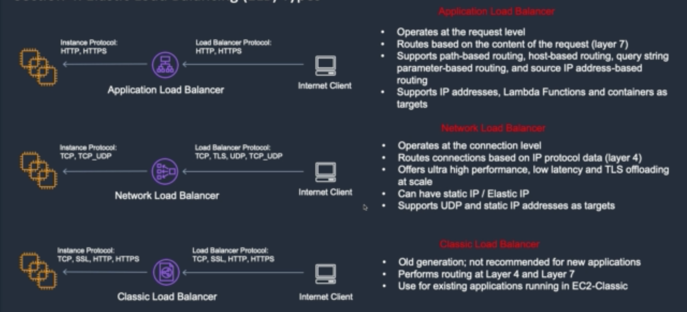

# Elastic Load Balancing Concepts

* 엘라스틱 로드 밸런서는 유일한 엔드포인트로서 외부의 접근을 받는다
* 이 때 동일한 작업을 수행하는 인스턴스들이 여러 AZ에 분산되어 있다면
* 엘라스틱 로드 밸런서는 이 인스턴스들을 타겟으로 지정해 트래픽을 분산시켜 준다
* 이와 같은 작업을 통해 ELB는 높은 가용성(high availability)과 fault tolerance를 제공한다
* 위 사진처럼 ELB는 여러 AZ들을 넘나들며 로드밸런싱을 할 수 있지만 여러 리전들을 넘나들지는 못한다

헬스 체크
* 헬스 체크를 통해 각 인스턴스들이 사용가능한지를 점검한다
* 만약 특정 인스턴스가 헬스체크에 실패하면 로드밸런서와의 커넥션을 드롭시킨다
* 드롭된 인스턴스의 트래픽은 로드밸런서가 다시 다른 인스턴스에 리라우트 시킨다

Classic Load Balancer
* Classic Load Balancer는 낡은 버전의 EC2에 적용하던 것으로
* 이제는 AWS에서 추천하지 않는 옵션이므로 이미 적용하고 있는 경우가 아니면 사용하지 않는 것이 좋다
* 클래식 로드밸런서는 레이어4와 레이어7 프로토콜을 다룬다(TCP, SSL, HTTP, HTTPS)
* EC2인스턴스도 같은 프로토콜을 적용받는다(TCP, SSL, HTTP, HTTPS)

Network Load Balancer
* 레이어4 프로토콜을 다루는 로드밸런서다
* 커넥션 레벨에서 작동하며 TCP, TLS, UDP, TCP_UDP 등을 다룬다
* 극도로 높은 퍼포먼스를 제공하기 위해 사용된다
* 정적 IP를 가질 수 있다
* UDP를 지원하며 정적 IP 주소를 타겟으로 삼는다

Application Load Balancer
* 레이어7 프로토콜을 다루는 로드밸런서다
* 요청 레벨에서 작동하며 HTTP, HTTPS를 다룬다
* path based routing과 host based routing 등 다양한 라우팅 기법을 제공한다
  - 위 두가지가 가장 일반적으로 사용되는 라우팅 기법이다
* IP주소, 람다 함수, 컨테이너를 타겟으로 삼는다