# Network Load Balancer

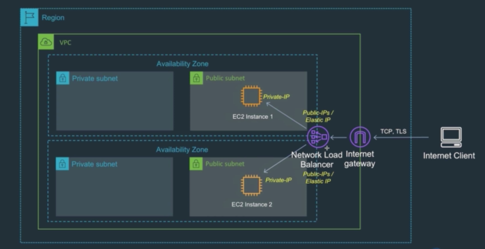
* 앞서 설명했던 네트워크 로드밸런서를 직접 사용해볼 것이다
* 대략적인 구조는 다음과 같다
* 외부에서 인터넷 게이트웨이를 통해 유일한 엔드포인트인 네트워크 로드밸런서에 요청을 보낸다
* 이를 위해 네트워크 로드밸런서는 정적IP를 가진다
* 요청을 받은 로드밸런서는 2개의 퍼블릭 서브넷에 위치한 인스턴스들에 번갈아가며 요청의 처리를 위임한다
* 이 때 로드밸런서는 각 인스턴스들의 Private IP를 사용해 통신한다
* 각 인스턴스들을 생성할 때 유저데이터를 통해 아파치 서버를 올리고 index페이지를 넣어 요청에 응답하도록 만든다
* 이 index 페이지는 앞서 만들었던 Amazon S3의 버킷에 업로드한 뒤 받아서 사용한다

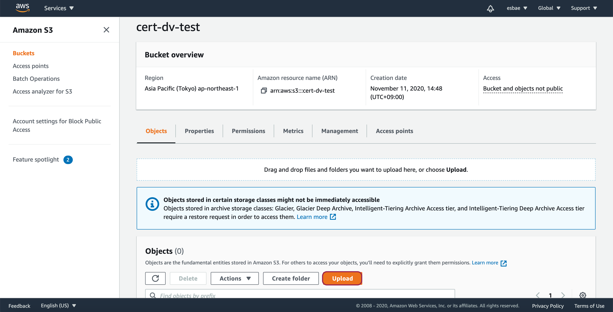
* 앞서 생성했던 버킷으로 이동해 index페이지와 names csv파일을 업로드한다

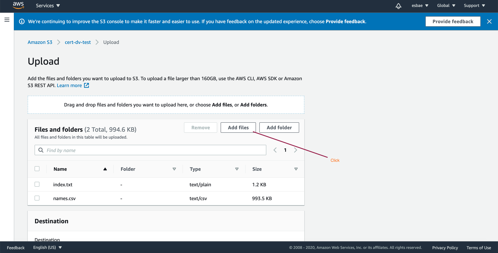
* Add files버튼을 눌러 파일을 찾아 올리면 된다
* 올린 후에는 스크롤을 아래로 내려 Upload버튼을 누르면 업로드가 완료된다

2개의 EC2 인스턴스 생성하기

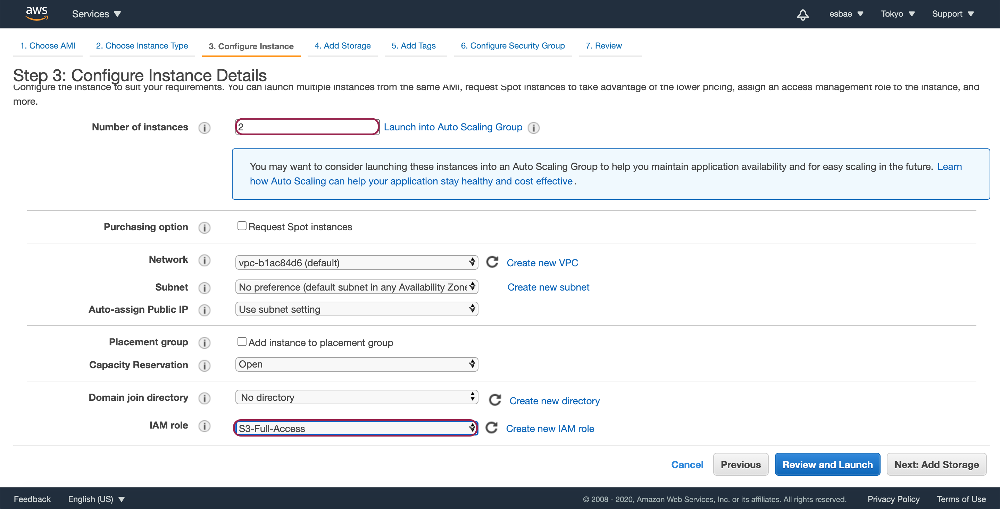

* Configure Instance Details설정 화면에서 Number of instances를 2로 설정한다
* IAM Role을 앞서 만들었던 S3에 대한 모든 권한을 갖고 있는 S3-Full-Access로 설정한다
* 스크롤을 내려 User Data란에 이하의 내용을 입력한다

```txt
#!/bin/bash
yum update -y
yum install httpd -y
systemctl start httpd
systemctl enable httpd
cd /var/www/html
aws s3 cp s3://<My-Bucket-Name>/names.csv ./
aws s3 cp s3://<My-Bucket-Name>/index.txt ./
EC2NAME=`cat ./names.csv|sort -R|head -n 1|xargs`
sed "s/INSTANCE/$EC2NAME/" index.txt > index.html
```

* 시큐리티 그룹은 Web-Access로 지정한다

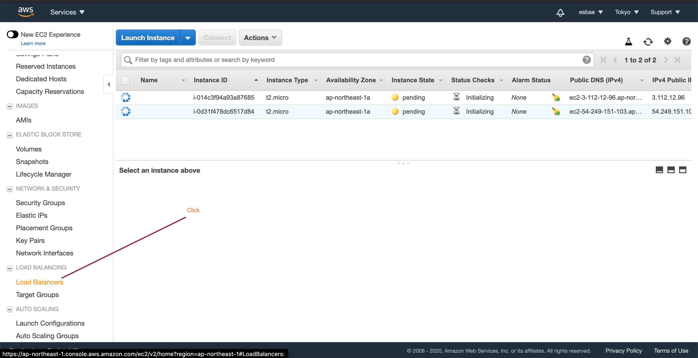
* 로드밸런서를 만들기 위해 EC2 네비게이션 탭에서 Load Balancers를 클릭한다

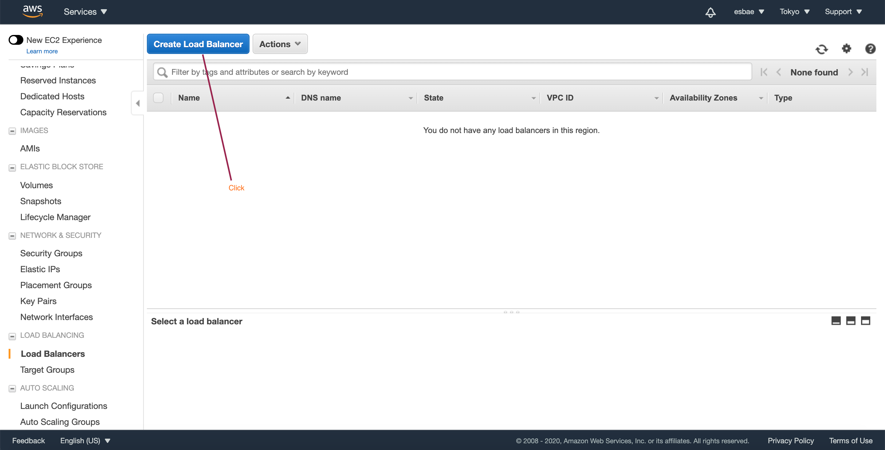
* Create Load Balancer버튼을 누른다

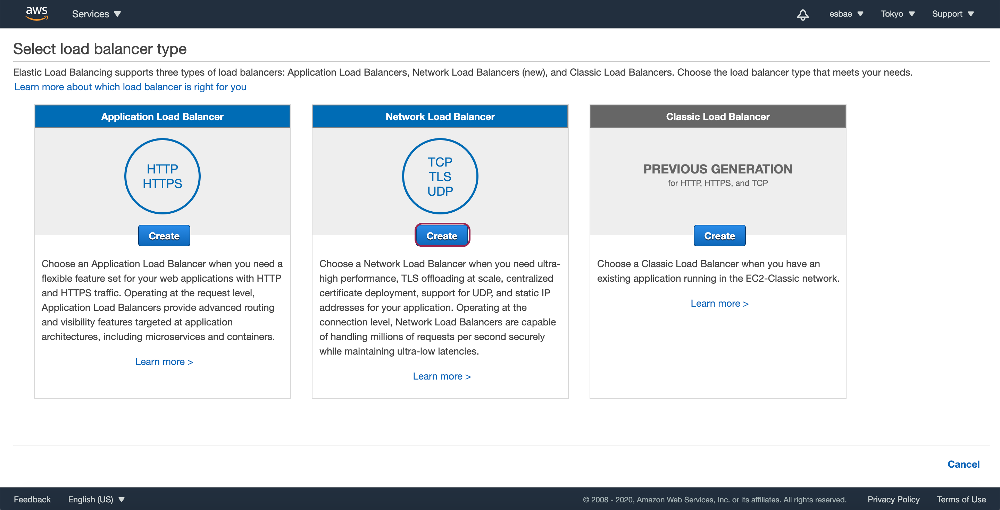
* 네트워크 로드밸런서의 Create버튼을 누른다

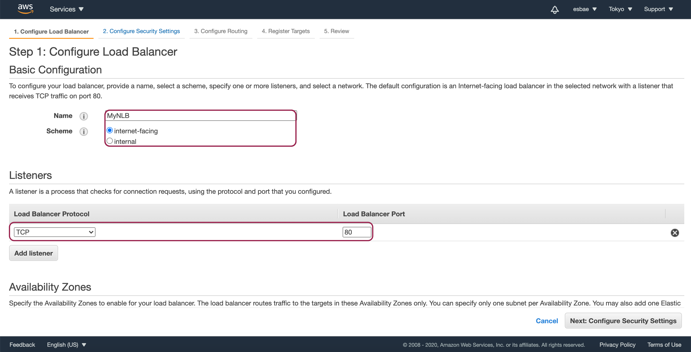
* 로드밸런서의 이름과 스키마 그리고 포트를 설정한다
* 인터넷과 연결되어야 하므로 스키마는 internet facing을 설정한다
* HTTP 통신을 할 것이기 때문에 TCP프로토콜에 포트 80을 설정해놓으면 된다

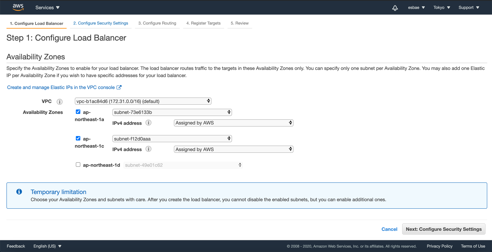
* 2개의 퍼블릭 서브넷을 사용하도록 설정한다
  - IPv4 address는 보유중인 Elastic IP가 있다면 해당 IP를 사용해도 된다
* Next버튼을 눌러 다음 설정으로 이동한다

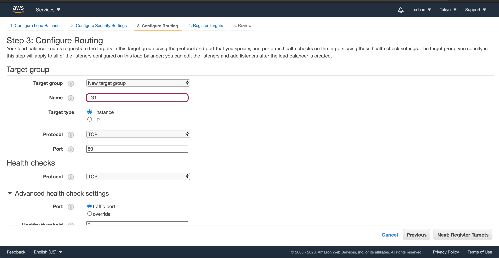
* 네트워크 로드밸런서와 어플리케이션 로드밸런서는 타겟 그룹을 가지며 타겟 그룹 안에 있는 타겟들에 요청을 분산시킨다
* 또한 타겟그룹을 통해 헬스체크도 수행한다
* 아직 생성한 타겟 그룹이 없으므로 New target group을 선택하고 타겟그룹의 이름을 지정한다 

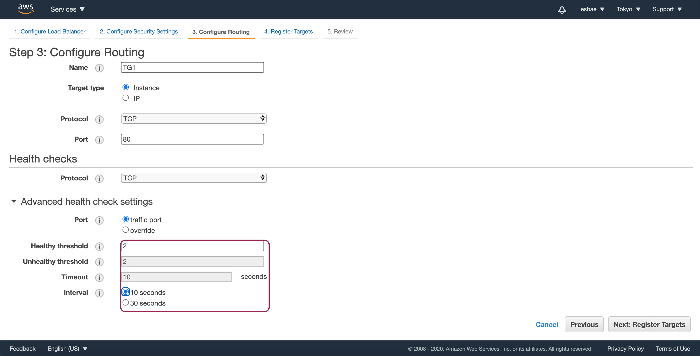
* 헬스체크 란에 보면 Advanced health check settings탭이 있다
* 여기서는 2개의 인스턴스만 사용할 것이므로 Healthy threshold를 2로 설정하고 체크주기인 interval은 10초로 설정한다

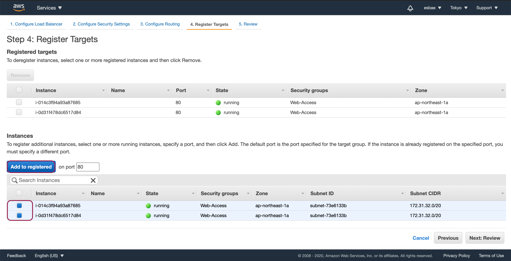
* 인스턴스 목록에 있는 앞서 생성한 2개의 인스턴스를 체크하고 Add to registered버튼을 클릭하면
* 위 사진과 같이 Registered targets에 2개의 인스턴스가 추가되는 것을 확인할 수 있을 것이다
* 추가를 완료한 후 Next버튼을 눌러 로드밸런서의 생성을 완료하자

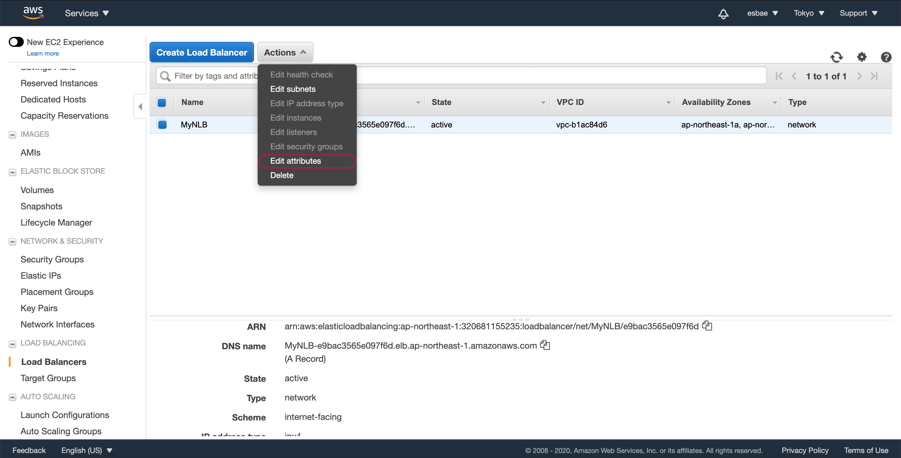
* 로드밸런서가 설정된 타겟들에 요청을 분산시켜 처리하도록 설정해주자
* 생성한 로드밸런서를 선택한 뒤 Actions -> Edit attributes를 클릭한다

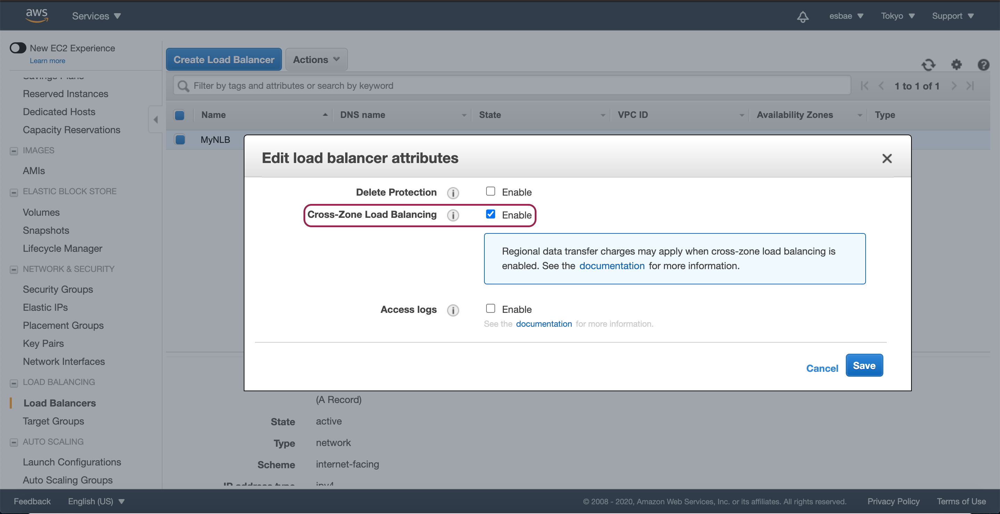
* Cross-Zone Load Balancing 설정을 Enable로 체크한 뒤 Save를 누른다
* 이제 로드밸런서에 요청이 들어오면 설정된 타겟들로 라운드로빈을 진행한다

실습이 끝난 뒤
* 로드밸런서와 EC2인스턴스를 제거해주자