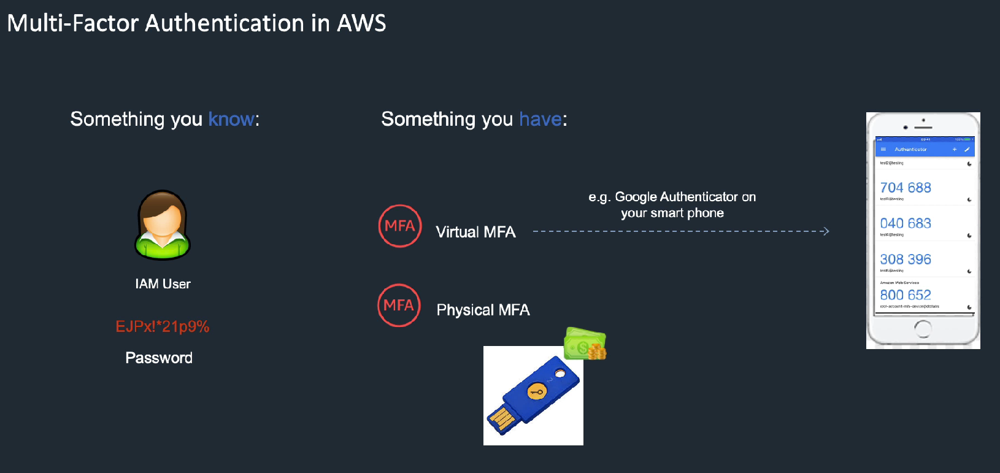

# Overview of IAM, VPC & AWS Free Tier Account

### Introduction to IAM Users, Groups, Roles and Policies

IAM

- IAM은 Identity and Access Management의 약자다
- IAM은 유저(user), 그룹(group), 정책(policie)을 활용해 AWS 계정 혹은 서비스에 접근할 수 있게 해주는 서비스다
- 유저, 그룹, 정책을 포함해 제공하는 기능들은 다음 사진과 같다

;

유저(User)

- 유저는 한 사람 혹은 하나의 서비스를 대표하는 엔티티다
- 유저를 사용해 AWS에 로그인하거나 특정 서비스에 접근할 수 있다
- 유저에는 특정 정책(policy)들을 할당할 수 있다
- 또, 유저에는 Access key ID, Secret key가 할당될 수 있다
  - 이 두가지를 다른 말로 Key pair라고도 부른다
  - 이것들은 AWS API, CLI, SDK, 다른 개발 툴을 이용한 프로그래머틱한 접근에 사용된다
- management console에 접근하기 위해 비밀번호도 할당될 수 있다
- 기본적으로 막 생성된 유저에는 어떤 것에도 접근할 수 있는 권한이 없다
  - 따라서 생성된 유저에 정책(policy)을 할당해 해당 유저가 필요한 서비스에 접근할 수 있게 해줘야 한다
- 루트 계정은 이메일과 패스워드를 사용하며, 어떤 제한도 받지 않고 서비스에 접근할 수 있는 권한을 가지고 있다
  - 너무 강력한 권한을 가지고 있기 때문에 루트 계정을 직접 사용해 서비스를 관리하는 것은 바람직하지 않다
  - 특정 서비스에 직접 접근하기 보다는 서비스에 필요한 유저와 정책, 그룹 등을 만들 때에 루트 유저를 사용하는 것이 좋다
  - 절대 다른 사람과 루트 계정을 공유하지 않는 것이 좋다
  - 필요하다면 특정 유저에 관리자 권한을 할당해 줄수도 있다
- MFA(Multi Factor Authentication)을 사용해 계정의 보호를 강화할 수 있다
- 유저는 특정 어플리케이션을 대표하기 위해 만드는 경우가 많다
  - 이 때, 이 유저를 서비스 계정(Service account)라고 부른다
- 하나의 AWS 계정당 5000명의 유저를 생성할 수 있다
  - 각각의 유저는 별칭과 아마존 자원 이름(ARN-Amazon Resource Name)이 할당된다
  - ARN은 AWS 안에서 각각의 유저를 구분하기 위한 유니크 식별자다

그룹(Group)

- 그룹은 유저의 무리를 지칭한다
- 유저와 마찬가지로 그룹에도 정책(policy)를 할당할 수 있다
- 만약 여러 유저에게 한 번에 정책을 할당하고 싶다면 그룹을 사용하는 것이 좋다
- 예를 들어, 한 회사 내에서 직군별로 그룹을 생성해 정책을 할당하면 반복적인 작업을 줄일 수 있다
  - ex. Developer, Sysadmin, etc department
- 그룹 자체는 어떤 권한과 관련된 내용이 없다
  - 다만 그룹에 정책을 할당하는 것이 가능할 뿐이다
- 가능한 필요한 최소한의 정책을 할당하는 것이 베스트 프랙티스다
- 그룹 안의 또 다른 그룹을 만드는 중첩은 불가능하다

역할(Role)

- 역할은 신뢰할 수 있는 엔티티에 의해 권한을 부여받는 기능이다
- 한마디로 위임된 권한이라고 볼 수 있다
- 여러 정책을 그룹지어 역할의 권한을 정의할 수 있다
  - ex. S3 Full Access, DynamoDB Read-Only, AWSLambdaBasicExecutionRole
- 역할은 AWS의 특정 서비스에서 사용될 수 있는데 다른 것들과 구분되는 장점이 있다면 영구적인 계정(유저이름과 비밀번호가 필요한 계정)을 사용하지 않고도 권한을 위임할 수 있다는 것이다
  - password도 access key도 필요없다
- IAM user와 AWS 서비스들은 역할을 임시적인 보안 계정으로 추정해 AWS API 호출을 사용할 수 있게 해준다

정책(Policy)

- 정책은 하나의 권한이며 유저, 그룹, 역할에 할당될 수 있다.
- S3 Full Access, DynamoDB Read-Only, AWSLambdaBasicExecutionRole
- 정책은 JSON 형식으로 작성된다.
- 모든 정책은 기본적으로 거부된다
  - 즉, S3 Full Access가 할당되기 이전에 S3 Full Access정책이 적용되었을 때와 같이 접근하는 것은 자동적으로 거부된다
- 최대 제한 정책이 적용된다
- IAM policy simulator는 접근 제한 정책의 효과들을 이해하고 테스트하고 검증하는 데 도움을 주는 도구다
- 상태 요소(Condition element)를 사용해 특정 상태에서만 권한의 적용을 사용할 수도 있다
  - 예를 들어 특정 IP로부터의 접근에서만 특정 정책을 허용하는 것

### IAM Authentication Methods

- 인증을 사용하는 방법들에 대해서 알아보자

접근 방법 1(액세스 키와 MFA)

- Access Key
  - 액세스 키는 액세스 키 아이디와 시크릿 액세스 키로 나뉜다
  - 액세스 키는 프로그래머틱한 접근에 사용된다
  - 예를 들어, CLI를 이용해 특정 서비스를 런치할 때 액세스 키가 사용된다
  - 액세스키는 생성하기, 보기, 수정하기, 교체하기가 가능하다
  - IAM에서 액세스 키를 생성하면 액세스 키 아이디와 시크릿 액세스 키가 반환된다
  - 이 때, 시크릿 액세스 키는 생성시 단 한번만 볼 수 있으므로 분실시에는 새로운 키를 재발급 받아야만 한다
  - IAM User는 IAM Policy를 통해 자신의 액세스키를 바꿀 수 있다(콘솔을 사용하지 않아도 된다)
  - 특정 액세스키를 API 호출이 불가능하도록 만들 수 있다
    - 예를 들어, 누군가 액세스키를 잃어버렸다면 해당 액세스키를 사용할 수 없게 만들 수 있다
- MFA
  - 액세스 키를 활용해 프로그래머틱하게 특정 API에 접근할 때, MFA로 다시 한번 검증을 할 수 있다

접근 방법 2(IAM User를 활용해 AWS management console에 접근하기)

- 일반적인 인증과 유사하게 아이디와 패스워드를 입력해 접근한다
- 강력한 패스워드 정책을 적용하는 것이 좋다
- SDK를 설치해서 CLI로 접근하는 접근 방법1과 달리 브라우저를 통한 비주얼적인 접근이 가능하다
- 이 방법에도 MFA를 적용해 이중으로 보안을 강화할 수 있다

접근 방법 3(Signing Certificate와 몇몇 AWS 서비스)

- Sigining Certificate란 SSL/TLS를 이용한 certificate를 의미한다
- SSL/TLS certificate는 몇몇 AWS 서비스에서만 사용할 수 있다
- AWS는 서버를 인증할 때 AWS Certificate Manager(ACM)을 사용해 프로비저닝, 관리, 배포에 사용할 것을 추천한다
- ACM이 지원되지 않는 지역에서만 https 연결이 필요할 때 IAM을 사용하는 것이 베스트 프랙티스다

### Multi Factor Authentication

접근 단계를 추가해 보안을 강화하기

- 가장 기본적인 접근은 유저의 아이디와 패스워드를 이용한 것이다
- Physical MFA
  - USB같은 곳에 물리적인 토큰을 저장해 놓을 수 있다
  - 그러나 USB는 이를 빼앗길 위험이 있다
- Virtual MFA
  - 인증할 때마다 유저의 핸드폰과 같은 기기에 특정 토큰을 생성해 전달하고 전달받은 토큰으로 인증하는 방식을 주로 사용한다
  - Google Authenticator같은 앱을 주로 사용한다
- 생체정보를 활용한 보안
  - 지문, 망막과 같은 생체정보를 활용한 인증도 사용할 수 있다

### AWS Security Token Service(STS)

STS란

- 임시적인 요청이 가능한 제한된 권한 자격을 IAM user나 연합 유저에 부여하기 위해 사용되는 서비스다
- STS는 글로벌 단위의 서비스이며 단일 엔드포인트를 가지고 있다(https://sts.amazonaws.com)
- 모든 리전에서 STS를 사용할 수 있다
  - 사용할 수 없게 만들 수도 있다

- 위의 그림의 예를 살펴보면 STS가 어떻게 활용되는지 이해할 수 있다
- Andrea는 다른 계정의 서비스를 사용하려고 한다
- 그러나 다른 계정의 서비스에 접근할 수 있는 권한이 없으므로 다른 계정의 역할에 접근할 수 있는 권한을 요청한다(1번)
- 그러면 다른 계정의 역할이 STS를 사용해(2번) 임시적으로 접근할 수 있는 자격을 부여한다(3번)
- 이렇게 얻은 임시적인 자격으로 Andrea는 다른 계정의 서비스를 사용한다

### Modifying the Sign-in Link

로그인하는 링크를 보다 유저친화적으로 변경하기

- 계정을 만들고 IAM 서비스에 들어가보면 위와 같이 유저넘버.signin.aws.amazon.com/console 형식으로 로그인 링크가 설정되어 있다
- 그러나 저렇게 긴 유저넘버를 외워서 입력하거나 다른 파일에 저장해놓았다가 붙여넣기 하기에는 너무 불편하다

- 이 문제는 같은 화면에 있는 커스터마이즈 버튼을 눌러 보다 기억하기 쉬운 링크로 변경할 수 있다
- 변경할 문자는 유니크한 값이어야 한다

### Setting up a Billing Alarm

빌링 알람 설정하기

- AWS는 지불가격에 따라 메일로 알람이 오도록 설정할 수 있다
- 빌링 알람은 오직 루트 계정에서만 접근할 수 있다

- 알람을 설정하는 페이지에 접근하기 위해서는 우선 루트 어카운트에 로그인 한 후 헤더에 있는 어카운트명을 클릭해 My Billing Dashboard에 접속해야 한다

- 대쉬보드 페이지가 뜨면 aside에 있는 Billing preferences를 누른다(빨간색 상자)
- 프리티어 계정을 사용하고 있는 경우 무료 제공량에 거의 도달했거나 초과했을 때 메일을 받아볼 주소를 입력할 수 있다(초록색 상자)
- 빌링 알람을 관리하려면 노란색 상자에 있는 Manage Billing Alerts를 누르면 CloudWatch페이지로 이동된다

- CloudWatch 페이지의 aside에 있는 Billing을 누르면 현재까지 설정한 빌링 알람 목록을 볼 수 있다
- 초록색 상자 안에 있는 Create alarm 버튼을 누르면 새로 빌링 알람을 만들 수도 있다

- 빨간 상자가 있는 폼에 알람을 발생시킬 한계값을 설정할 수 있다
- 설정한 뒤 Next버튼을 누른다

- CloudWatch에서 SNS Topic을 생성시킬수 있는 화면이 나온다
- SNS란 Simple Notification Service의 약어로 AWS에서 메시지를 보내는 서비스 중에 하나다
- 토픽 이름과 알람을 받아볼 메일을 폼에 입력한 후 Create topic버튼을 누르면 알람이 만들어진다
- 토픽이 생성되면 아래로 스크롤을 내려 Next버튼을 누른다

- 알람의 이름과 설명을 입력하는 란이 나온다
- 입력하고 Next버튼을 누른다

- 지금까지 설정한 알람에 관한 내용들을 확인할 수 있다
- 확인한 후 스크롤을 내려 Create alarm버튼을 누르면 알람이 생성된다

- 지금까지의 과정과 같이 새 알람을 생성할 수도 있고 기존의 알람을 관리할 수 있다
- 빨간 상자에 있는 버튼을 클릭하면 Amazon SNS에서 대기중인 Subscription을 확인할 수 있을 것이다

- 생성은 완료되었지만 아직 승인이 되지 않아 대기중(Pending)인 것을 알 수 있다
- 이제 알람에 설정해놓은 이메일에 들어가 AWS로부터 온 메일이 없는지 확인해보자

- Confirm subscription을 눌러 알람을 승인한다

- 다시 SNS로 돌아가 새로고침을 해보면 Pending이었던 상태가 Confirmed으로 바뀐 것을 확인할 수 있을 것이다

### Active MFA on the Root Account

MFA를 루트 계정에 설정하기

- 우선 IAM에 접속한다

- Security Status에 있는 Delete your access keys를 누르면 아래와 같은 버튼이 나온다

- 빨간 상자 안의 버튼을 눌러 관리화면으로 이동하자

- MFA란을 클릭하면 설명과 Activate MFA버튼이 나온다
- 버튼을 클릭하면 MFA 생성 모달이 나올 것이다

- 여기서는 Virtual MFA device을 옵션을 지정해 휴대폰을 이용한 인증을 추가할 것이다
- 그리고 안전한 인증을 위해 Google Authenticator를 활용할 것이다
- Virtual MFA device 라디오 버튼을 체크하고 Continue버튼을 누르자

- Show QR code를 누르면 스캔 가능한 QR code가 생성될 것이다
- Google Authenticator앱을 휴대폰에 설치하고 스캔을 통해 아래 폼에 두 개의 MFA code를 입력하고 Assign MFA버튼을 누른다

- MFA 설정이 완료됐음을 확인할 수 있다
- 로그아웃한 뒤 다시 로그인해보면 패스워드를 입력한 뒤에 Google Authenticator에서 코드를 입력해야 접속이 가능함을 확인할 수 있다
